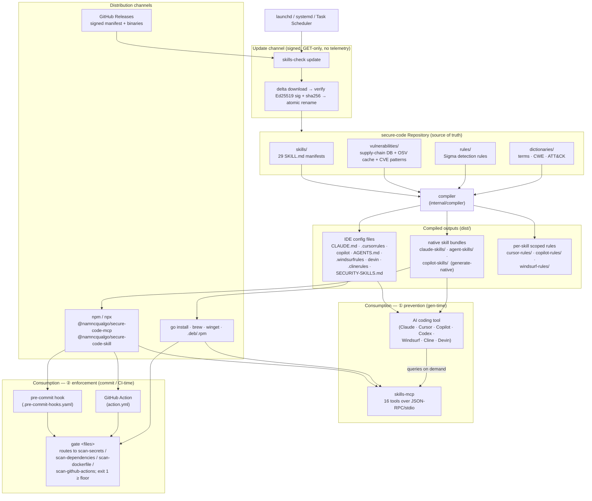
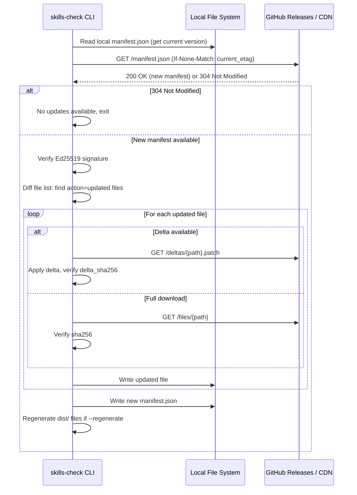

# secure-code — Architecture

This document describes the runtime architecture of the **secure-code** project
(Go module path [`github.com/namncqualgo/skills-library`](https://github.com/namncqualgo/skills-library);
CLI binary `skills-check`). The Go module path and CLI binary name (`skills-check`)
are stable technical identifiers.

## System Overview

secure-code operates at **two enforcement points** in the developer workflow:

1. **Prevention (generation-time).** Compiled rule files (`dist/`) and the MCP
   server feed security knowledge *into* the AI before any code is written.
2. **Enforcement (commit / CI-time).** The `gate` command — exposed as a CLI
   subcommand, a pre-commit hook, and a GitHub Action — *blocks* code that
   carries secrets, vulnerable dependencies, or unsafe Dockerfile / workflow
   configuration after the fact.

The same Go library backs both points, so a finding is identical whether it
surfaces inside the AI session or in CI.



The diagram shows the runtime subsystems and how the developer experience flows
through them:

- **Repository** — the canonical source of truth. Skills, vulnerability data, detection
  rules, and dictionaries are checked into Git. Everything is plain JSON / YAML /
  Markdown so PRs are reviewable.
- **Compiler** — `internal/compiler` reads every input source and produces (a) one
  IDE-specific config file per supported tool, each pinned to a token-budget tier;
  (b) native skill bundles for agents that load `agentskills.io`-style skill
  directories (`generate-native`); and (c) per-skill scoped rule files for editors
  that support rule scoping.
- **Distribution channels** — three independent paths: `npx`/npm (no Go, no clone),
  `go install` / Homebrew / winget / system packages, and signed GitHub Releases.
- **Prevention (gen-time)** — IDE files inject rules at session start; the MCP server
  answers scan/lookup queries on demand during the session.
- **Enforcement (commit/CI-time)** — the `gate` command, wired into pre-commit and a
  GitHub Action via the published npm package, fails the build on findings at or above
  a severity floor.
- **Update channel** — signed releases carry deltas forward to installed CLIs; the CLI
  verifies signatures before writing any file. Each OS schedules updates with its
  native mechanism; no daemons.

## `SKILL.md` Schema (Detailed)

The `SKILL.md` format is the contract between skill authors, the compiler, and the
validator. Every field is checked by `skills-check validate`.

### Frontmatter fields

| Field | Type | Required | Validation |
|-------|------|----------|------------|
| `id` | string | yes | kebab-case, unique across the library, matches directory name |
| `version` | string (semver) | yes | matches `^\d+\.\d+\.\d+$` |
| `title` | string | yes | < 80 chars |
| `description` | string | yes | 1 line, < 200 chars |
| `category` | enum | yes | one of `prevention`, `detection`, `compliance`, `supply-chain`, `hardening` |
| `severity` | enum | yes | one of `critical`, `high`, `medium`, `low` |
| `applies_to` | list of strings | yes | natural-language activation hints |
| `languages` | list of strings | yes | `["*"]` for language-agnostic, otherwise lowercase language identifiers |
| `token_budget` | object | yes | three integer fields: `minimal`, `compact`, `full` |
| `rules_path` | string | no | relative path to a directory of machine-readable rules |
| `tests_path` | string | no | relative path to a directory of test corpus files |
| `related_skills` | list of strings | no | other skill IDs |
| `last_updated` | string (ISO date) | yes | `YYYY-MM-DD` |
| `sources` | list of strings | yes | at least one external authoritative source |

### Body structure

The markdown body is divided into three named sections in this exact order:

1. **`## Rules (for AI agents)`** — the machine-consumable instructions. Subsections
   must include `### ALWAYS`, `### NEVER`, and `### KNOWN FALSE POSITIVES`. Bullets
   inside these subsections are what the compiler extracts for the `minimal` tier.
2. **`## Context (for humans)`** — rationale, background, and why this matters. This is
   included in the `full` tier and stripped in `compact` / `minimal`.
3. **`## References`** — links to rule files and external standards.

The strict section ordering means the compiler can extract each tier with a simple
markdown walker rather than re-parsing per skill.

## `dist/` Compiler Architecture

The compiler is a pure function from `(skills, vulnerabilities, dictionaries, tool,
budget)` to a single rendered file. Pseudocode for the per-target compilation loop:

```
For each target tool:
  1. Load all skills matching the selected skill set
  2. For each skill, extract the appropriate token_budget tier
  3. Apply tool-specific formatting:
     - CLAUDE.md: markdown with ## headers per skill
     - .cursorrules: flat instruction format
     - copilot-instructions.md: markdown with clear sections
     - AGENTS.md: agent-oriented instruction format
  4. Inject vulnerability database summary (top N critical items)
  5. Inject relevant dictionary entries inline (security terms the AI needs)
  6. Calculate total token count, warn if exceeding tool's effective limit
  7. Write to dist/{filename}
```

The tool-specific formatters live in `cmd/skills-check/internal/compiler/` and each
implements a small `Formatter` interface. Adding a new IDE tool means writing one
file: a new formatter plus a registration line.

## Manifest and Update Protocol

The wire format is a single JSON file plus optional delta patches. The signature is
over the entire JSON (excluding the `signature` field itself) using Ed25519 with the
embedded public key.

```json
{
  "schema_version": "1.0",
  "version": "2026.05.12.1",
  "previous_version": "2026.05.11.3",
  "released_at": "2026-05-12T10:30:00Z",
  "signature": "ed25519:<base64-encoded-signature>",
  "public_key_id": "secure-code-release-2026",
  "files": [
    {
      "path": "skills/secret-detection/SKILL.md",
      "sha256": "abc123...",
      "size": 2048,
      "action": "unchanged"
    },
    {
      "path": "vulnerabilities/supply-chain/malicious-packages/npm.json",
      "sha256": "def456...",
      "size": 45000,
      "action": "updated",
      "delta_from": "2026.05.11.3",
      "delta_sha256": "ghi789...",
      "delta_size": 1200
    }
  ]
}
```

### Update flow



Two safety properties hold across the flow:

- **Atomic writes.** Every file is written to a sibling temp path and `rename`d into
  place. A crash mid-update leaves the previous version intact.
- **Verify-before-replace.** Signature and per-file checksums are verified before any
  rule file is written. A bad signature aborts the entire update.

## CLI Architecture (`skills-check`)

The CLI is a single Cobra-based Go binary. Layout:

```
cmd/skills-check/
├── main.go                    # cobra root command
├── cmd/
│   ├── root.go                # root command + subcommand registration
│   ├── init.go                # skills-check init --tool <tool> --skills <list> --budget <tier> [--no-prompt]
│   ├── update.go              # skills-check update [--regenerate|--check-only|--rollback|--source]
│   ├── validate.go            # skills-check validate [--path <dir>]
│   ├── list.go                # skills-check list [--category <cat>]
│   ├── regenerate.go          # skills-check regenerate [--tool <tool>] [--budget <tier>]
│   ├── version.go             # skills-check version
│   ├── manifest.go            # skills-check manifest compute/verify/sign/delta
│   ├── scheduler.go           # skills-check scheduler install/remove/status
│   ├── selfupdate.go          # skills-check self-update (download + SHA-256 verify + atomic replace)
│   ├── new.go                 # skills-check new <id> (skill scaffolder)
│   ├── test.go                # skills-check test <id> (test corpus runner)
│   ├── evidence.go            # skills-check evidence --framework SOC2|HIPAA|PCI-DSS
│   ├── configure.go           # skills-check configure (writes .skills-check.yaml)
│   ├── fetch_vulns.go         # skills-check fetch-vulns [--from-release|--check|--only]
│   ├── generate_native.go     # skills-check generate-native (native skill bundles
│   │                          #   → dist/{claude,agent,copilot}-skills)
│   ├── derive_checklists.go   # skills-check derive-checklists <skill-id>
│   │                          #   (build checklists/*.yaml from SKILL.md markers)
│   ├── eval.go                # skills-check eval [--all] — prevention-lift bench:
│   │                          #   judges baseline vs with-skill generations via the
│   │                          #   gate scanners or a signature regex → evals.json
│   ├── tools_cli.go           # scanner subcommands sharing the MCP library:
│   │                          #   check-dependency / check-typosquat /
│   │                          #   lookup-vulnerability / scan-secrets /
│   │                          #   scan-dependencies / scan-dockerfile /
│   │                          #   scan-github-actions / gate (alias policy-check)
│   └── cmd_test.go            # integration tests for every subcommand
└── internal/
    ├── token/                 # tiktoken-go counter + 1.3x Claude multiplier + budget enforcer
    ├── compiler/              # dist/ file generators per tool + context loader
    │   ├── compiler.go        # Core compile loop, formatter registry, token reporting
    │   ├── context.go         # Vulnerability summary, glossary, ATT&CK injection
    │   ├── claude.go          # CLAUDE.md formatter
    │   ├── cursor.go          # .cursorrules formatter
    │   ├── copilot.go         # copilot-instructions.md formatter
    │   ├── agents.go          # AGENTS.md formatter (also serves codex)
    │   ├── windsurf.go        # .windsurfrules formatter
    │   ├── devin.go           # devin.md formatter (defaults to full tier)
    │   ├── cline.go           # .clinerules formatter
    │   ├── universal.go       # SECURITY-SKILLS.md formatter
    │   ├── native.go          # native skill-bundle emitter (claude/agent/copilot skills)
    │   ├── rule_bundles.go    # per-skill scoped rule files (cursor/copilot/windsurf-rules/)
    │   ├── pointer.go         # pointer/loader stubs that reference the scoped rules
    │   ├── profiles.go        # LoadProfile, ListProfiles, FilterSkillsByProfile
    │   ├── packaging_test.go  # validates packaging/* manifests are well-formed
    │   └── rules_test.go      # walks rules/**/*.yml and asserts the Sigma schema
    ├── manifest/              # manifest.json: load/save, SHA-256 checksum, Ed25519 sign/verify (incl. VerifyAny over multiple trusted keys), delta, atomic write
    ├── updater/               # Remote update engine: HTTP / dir / tarball sources (HTTP supports bearer-token auth for private repos), verify-before-replace, rollback
    └── scheduler/             # Cross-platform scheduled updates (launchd / systemd / Task Scheduler)

cmd/skills-mcp/                # Model Context Protocol server
├── main.go                    # resolve library root, wire stdio JSON-RPC loop
└── internal/
    ├── mcp/   (server.go)     # JSON-RPC 2.0 dispatch + tools/list definitions
    └── tools/ (tools.go)      # the 16 tools/call handlers (lookup_vulnerability,
                               #   check_secret_pattern, get_skill, search_skills,
                               #   list_external_tools, scan_secrets, scan_dependencies,
                               #   scan_dockerfile, scan_github_actions, check_dependency,
                               #   check_typosquat, map_compliance_control, get_sigma_rule,
                               #   explain_finding, version_status, gate)

internal/skill/                # SKILL.md parser (frontmatter + markdown body + tier extraction)
                               # — shared between skills-check and skills-mcp
```

The `updater/` package implements the full update protocol. `scheduler/` generates
native artifacts (plist, systemd units, Task Scheduler XML) and shells out to the
OS tools to install/remove them.

The binary is built with `-trimpath -ldflags "-s -w"` for reproducibility. The embedded
Ed25519 public key is injected at build time via `-X` ldflags so the same source tree
can be built against different signing keys for staging versus production.

## MCP Server Architecture (`skills-mcp`)

`skills-mcp` is a second Go binary that exposes secure-code to AI tools
speaking the Model Context Protocol. It runs as a short-lived child process
spawned by the AI client and talks to it over stdio.

- **Transport.** JSON-RPC 2.0, one message per line. Requests arrive on
  stdin; responses go to stdout. Notifications (no `id`) produce no response.
- **Methods.** `initialize` returns `serverInfo`. `tools/list` returns the
  sixteen tool definitions with input schemas. `tools/call` dispatches by name.
- **Library root resolution.** `--path <dir>`, then `$SKILLS_LIBRARY_PATH`,
  then the directory containing the binary. The root must contain a
  `skills/` subdirectory.
- **Tools (16).** They fall into four groups:
  - *Knowledge lookups* — `get_skill` (parse `skills/{id}/SKILL.md`, return the
    requested tier), `search_skills` (substring match across manifests),
    `list_external_tools` (read a skill's `external_tools` frontmatter),
    `get_sigma_rule`, `map_compliance_control`, `explain_finding`,
    `version_status`.
  - *Package intelligence* — `lookup_vulnerability` and `check_dependency` read
    `vulnerabilities/supply-chain/malicious-packages/{ecosystem}.json`
    (npm, pypi, crates, go, rubygems, maven, nuget, github-actions, docker),
    the typosquat DB, and the OSV cache; `check_typosquat` flags candidates.
  - *File scanners* — `scan_secrets` runs the regex rules from the `checks:`
    block of `skills/secret-detection/checklists/secret_detection.yaml` (applying
    its `exclusions:`); `scan_dependencies`, `scan_dockerfile`, and
    `scan_github_actions` parse the respective file types.
  - *Enforcement* — `gate` routes a file to the matching scanner (falling back to
    a secret scan) and returns a CI-friendly `pass` flag + `exit_code` keyed off a
    severity floor.
- **`check_secret_pattern`** is the legacy inline-text variant of `scan_secrets`,
  kept for callers that pass raw text rather than a path.

The MCP server reuses the parser at `internal/skill/` rather than duplicating
the SKILL.md format implementation. The stdio transport is pure stdlib; `net/http`
is used only for the opt-in live OSV.dev enrichment path (`--vuln-source
external|hybrid`), never for telemetry.

## Scheduler Implementation Details

The scheduler subsystem produces native artifacts for each OS. The CLI does not run as
a long-lived process; the scheduler launches the CLI on its own.

### macOS (`launchd`)

```xml
<?xml version="1.0" encoding="UTF-8"?>
<!DOCTYPE plist PUBLIC "-//Apple//DTD PLIST 1.0//EN" "http://www.apple.com/DTDs/PropertyList-1.0.dtd">
<plist version="1.0">
<dict>
    <key>Label</key>
    <string>com.skills-library.update</string>
    <key>ProgramArguments</key>
    <array>
        <string>/usr/local/bin/skills-check</string>
        <string>update</string>
        <string>--regenerate</string>
        <string>--quiet</string>
    </array>
    <key>StartInterval</key>
    <integer>21600</integer>
    <key>StandardOutPath</key>
    <string>/tmp/skills-check-update.log</string>
    <key>StandardErrorPath</key>
    <string>/tmp/skills-check-update.log</string>
</dict>
</plist>
```

The plist is written to `~/Library/LaunchAgents/com.skills-library.update.plist` and
loaded via `launchctl load`. `StartInterval=21600` is six hours in seconds; the value
is parameterized by `--interval`.

### Linux (`systemd`)

```ini
# ~/.config/systemd/user/skills-check-update.service
[Unit]
Description=Skills Library Update

[Service]
Type=oneshot
ExecStart=/usr/local/bin/skills-check update --regenerate --quiet

# ~/.config/systemd/user/skills-check-update.timer
[Unit]
Description=Skills Library Update Timer

[Timer]
OnBootSec=5min
OnUnitActiveSec=6h

[Install]
WantedBy=timers.target
```

The pair is enabled via `systemctl --user enable --now skills-check-update.timer`.
User-scope systemd means no root involvement; the timer runs only while the user is
logged in, which matches the desktop-developer workflow.

### Windows (Task Scheduler)

Task Scheduler integration generates an XML task definition and calls `schtasks.exe`
to create the task (no COM dependency). The created task:

- Task name: `SkillsLibraryUpdate`
- Trigger: repeat every six hours
- Action: `skills-check.exe update --regenerate --quiet`
- Run whether user is logged on or not (with stored credentials)
- Stop the task if it runs longer than 10 minutes (defensive cap against a stuck
  update)

## Vulnerability Database Schema

Every malicious-package file in `vulnerabilities/supply-chain/malicious-packages/`
shares this schema. Per-ecosystem files keep diffs small and let CI parallelize
validation.

```json
{
  "schema_version": "1.0",
  "ecosystem": "npm",
  "last_updated": "2026-05-12T10:00:00Z",
  "entries": [
    {
      "name": "event-stream",
      "versions_affected": ["3.3.6"],
      "type": "malicious_code",
      "severity": "critical",
      "discovered": "2018-11-26",
      "description": "Maintainer account compromised; malicious flatmap-stream dependency added to steal cryptocurrency wallets",
      "references": ["https://blog.npmjs.org/post/180565383195/details-about-the-event-stream-incident"],
      "indicators": ["flatmap-stream dependency"],
      "cve": "CVE-2018-16492",
      "attack_type": "maintainer_compromise"
    }
  ]
}
```

### Attack type taxonomy

The `attack_type` field is a closed enum so the AI can reason about the kind of
threat and act differently per category.

| `attack_type` | Description |
|---------------|-------------|
| `maintainer_compromise` | Legitimate maintainer's credentials stolen and used to publish a malicious version |
| `typosquat` | New package whose name is a slight misspelling of a popular one |
| `dependency_confusion` | Public package shadowing an internal name |
| `protestware` | Maintainer intentionally publishes destructive code for political reasons |
| `cryptominer` | Package mines cryptocurrency on install or runtime |
| `data_exfiltration` | Package exfiltrates secrets, files, or environment to a remote server |
| `backdoor` | Persistent remote-control or remote-code-execution capability |
| `install_script_abuse` | Malicious `postinstall` / `setup.py` / `build.rs` behavior |

## Token Counting

Token counts are computed at compile time so authors get fast feedback.

- **OpenAI-family models** — use `tiktoken` with the `cl100k_base` encoding (matches
  GPT-4 / GPT-4o family).
- **Claude-family models** — apply a conservative `1.3x` multiplier on the
  `cl100k_base` count. This consistently overestimates rather than underestimates, so
  budget checks are safe.
- **The compiler reports token counts for each generated `dist/` file**, including a
  per-skill breakdown.
- **Warning thresholds.** `> 4000` tokens for the `compact` tier or `> 8000` tokens for
  the `full` tier triggers a compiler warning. Going over the declared budget in the
  skill's frontmatter is a build error.

## Security of the Library Itself

secure-code is itself a piece of security tooling. Its supply chain must be
defended.

- **All releases are Ed25519-signed.** The signing key is hardware-backed (YubiKey)
  and held by the release maintainer; CI does not have direct access to it.
- **CI runs `skills-check validate` on every PR.** Schema violations, broken token
  budgets, and missing references all block merge.
- **Vulnerability database entries require at least one external reference** (CVE,
  advisory URL, blog post). No anonymous "trust me" entries.
- **No PII in any data file.** No researcher emails, no reporter names, no internal
  ticket numbers. Public advisories only.
- **CLI binary is reproducibly built** (`go build -trimpath -ldflags "-s -w"`). The
  release pipeline publishes the SHA-256 of every binary alongside the release.
- **CLI never writes to any network destination.** All HTTP traffic is `GET`-only,
  fetching public release artifacts.
- **CLI never collects telemetry, analytics, or usage data.** There is no opt-in
  toggle; the code that would do this does not exist.

## Enterprise Layout

The enterprise layout adds three sibling directories at the repo root that the
CLI loads on demand. None of them change the core SKILL.md schema or break the
core layout.

```
profiles/                 # --profile <name> mappings
├── financial-services.yaml
├── healthcare.yaml
└── government.yaml

compliance/               # framework → control → skill mappings
├── soc2_mapping.yaml
├── hipaa_mapping.yaml
└── pci_dss_mapping.yaml

sdk/                      # programmatic access
├── go/                   # re-exports of internal/skill
├── python/               # skillslib (pyproject.toml, PyYAML)
└── typescript/           # skillslib npm package (js-yaml, ESM)
```

- **Profiles** are pure YAML — they list the skill IDs to enable plus optional
  control hints. `init` and `regenerate` filter the loaded skills via
  `compiler.FilterSkillsByProfile`.
- **Compliance mappings** are loaded by `skills-check evidence` and rendered
  to either JSON (for audit pipelines) or Markdown (for human-readable
  evidence reports).
- **SDKs** are thin façades over the same SKILL.md schema. The Go SDK
  imports `internal/skill` directly. The Python and TypeScript SDKs
  reimplement the parser and validator independently so they have no Go
  build dependency.
- **`.skills-check.yaml`** is written by `skills-check configure`. It
  configures private-repo deployments: alternate update source, bearer
  token env var, additional trusted Ed25519 public keys, and selected
  profile / skill set. `internal/manifest.VerifyAny` accepts a signature
  valid under any of the trusted keys (embedded build-time key plus
  paths loaded from this file).
