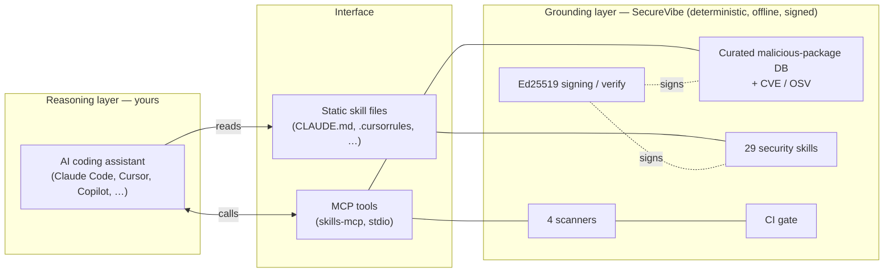
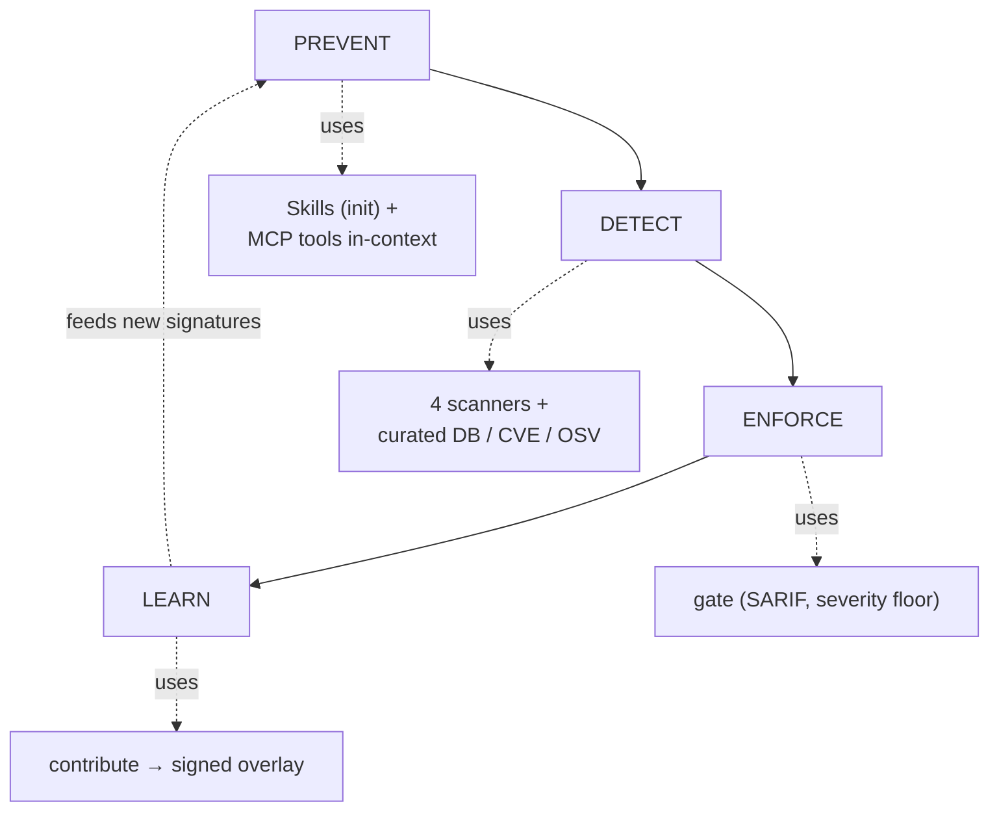
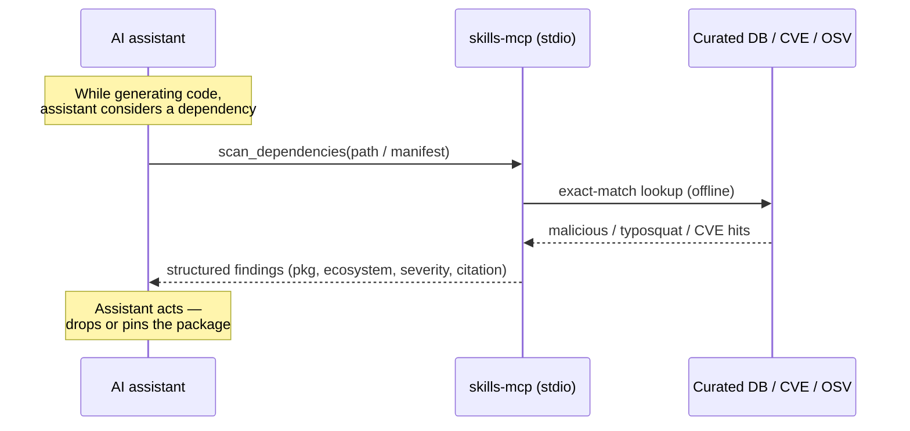

# Architecture

SecureVibe is a deterministic, fully offline *grounding* layer that feeds signed security knowledge and verifiable findings to your AI coding assistant — it never embeds or calls a model itself.

## The two-layer design

SecureVibe deliberately splits the system into two layers that meet at a narrow, well-defined interface.

- **The grounding layer (SecureVibe — the source of truth).** A deterministic Go core: the curated malicious-package database, the security skills, the four scanners, the Ed25519 signing/verification machinery, and the CI `gate`. Everything here is reproducible — the same input always produces the same output, and nothing requires a network or an API key.
- **The reasoning layer (your AI assistant).** Claude Code, Cursor, Copilot, Codex, Windsurf, Cline/OpenCode, Antigravity, or Devin. This is where natural-language understanding and code generation happen. SecureVibe **never embeds, bundles, or calls an LLM** — the model is supplied and run entirely by you.

SecureVibe is therefore **grounding plus orchestration**; the model is the reasoning engine. The two layers communicate only through static skill files and the MCP tool surface.

!!! note "Why keep the model out"
    Because the core is deterministic and keyless, every finding is reproducible and auditable, releases can be cryptographically signed, and the whole tool runs offline in CI. The trade-off is explicit: the core catches **known** patterns and **misses novel or semantic bugs** — that work belongs to the reasoning layer it grounds, not to SecureVibe.



## Four surfaces

SecureVibe plugs into a workflow through four distinct surfaces. The first two ground the assistant *before* code is written; the last two verify *after*.

| Surface | Component | How it connects | Primary command |
| --- | --- | --- | --- |
| Static skill files | `skills-check init` | Writes the assistant's native config so security knowledge is always in context | `skills-check init --tool claude` (also `cursor`, `copilot`, `codex`, `windsurf`, `cline`, `devin`) |
| MCP server | `skills-mcp` | Exposes **16 tools** over stdio; the assistant calls them on demand for live, deterministic lookups | `claude mcp add securevibe -- npx -y @namncqualgo/secure-code-mcp` |
| CLI scanners | `skills-check scan-*` | The four deterministic scanners, run by a human or a script | `skills-check scan-dependencies <path>` |
| CI gate | `skills-check gate` | Blocks insecure diffs in CI; auto-picks the scanner per file and emits SARIF | `skills-check gate <path> --min-severity high --sarif results.sarif` |

!!! tip "Surfaces compose"
    `init` puts the skills *in front of* generation, the MCP tools let the assistant *check itself* mid-task, the scanners give a human a manual pass, and the `gate` is the non-negotiable backstop in CI. You can adopt any subset.

The four scanners behind surfaces (c) and (d) are: **secrets**, **dependencies** (malicious / typosquat / CVE / OSV), **Dockerfile**, and **GitHub Actions**. Detection is **narrow by design** — this is not a general-purpose SAST and does not aim to find every vulnerability.

## The lifecycle

The four stages map one-to-one onto components. (`ANALYZE` and `VERIFY` are future, demand-gated stages — they are not built today.)



| Stage | What happens | Component touched |
| --- | --- | --- |
| **PREVENT** | Signed skills sit in the assistant's context so it writes secure code at generation time | `init` config files, `skills-mcp` |
| **DETECT** | Deterministic scanners flag known issues with zero-false-positive exact-match lookups | 4 scanners, curated DB + CVE + OSV |
| **ENFORCE** | The gate fails the build above a severity floor and emits SARIF for GitHub Code Scanning | `skills-check gate` |
| **LEARN** | A new finding is captured into a signed overlay that feeds back into prevention/detection | `skills-check contribute`, `.skills-check/overlay.json` |

## An MCP request, end to end

When the assistant calls an `skills-mcp` tool, the work is a deterministic lookup — no model, no network beyond the local data the binary already carries.



Because the lookup is exact-match against the curated database, a hit is a true positive (the data moat is its zero-false-positive property); a miss simply means SecureVibe holds no signature for it, not that the package is proven safe.

## Repo layout

The top-level directories that matter for understanding the build:

```text
skills-library/
├── skills/                       # 29 security SKILL.md knowledge files (3 token tiers)
├── vulnerabilities/
│   ├── supply-chain/             # curated malicious-package DB (3,623 entries, 10 ecosystems)
│   ├── cve/                      # 58 CVE code-patterns
│   └── osv/                      # OSV-format vulnerability data
├── compliance/                   # SOC2 / HIPAA / PCI-DSS control mappings (*.yaml)
├── profiles/                     # enterprise profiles: financial-services / government / healthcare
├── rules/                        # 27 Sigma detection rules (cloud / container / endpoint / saas)
├── cmd/
│   ├── skills-check/             # the Go CLI: scanners, gate, init, contribute, self-update
│   └── skills-mcp/               # the MCP server (16 tools over stdio)
└── dist/                         # built/generated artifacts shipped with releases
```

!!! warning "Editing the curated DB"
    Changing anything under `vulnerabilities/**` requires regenerating the distributed artifacts (`skills-check regenerate`) — `dist/` carries a derived summary that local validation alone won't catch drifting.

## Trust & data integrity

Every layer of SecureVibe is verifiable without trusting a server.

- **Signed releases.** Each release ships a manifest carrying a **per-file SHA-256** checksum, plus a detached **Ed25519** signature over the manifest. The private signing key is held **offline**.
- **Verified self-update.** `skills-check self-update` fetches the signed manifest, verifies the **signature first, then the checksums**, and only then performs an **atomic rename** to replace the binary (crash-safe).
- **Signed contribution overlays.** `contribute add` writes a signed local `.skills-check/overlay.json`; import is **signature-gated** (`--allow-unsigned` is an explicit opt-in). Overlays fan out by scope: you (the file) → team (commit it; git is the distribution) → org (`$SKILLS_CHECK_OVERLAY` path-list env var).
- **Offline by construction.** No telemetry, no cloud dependency, no API key. Determinism plus signatures means findings are reproducible and the supply chain is auditable end to end.

See the [Developer guide](../guides/developer.md) for working on the core, or the [Quick start](../quickstart.md) to wire SecureVibe into an assistant.
