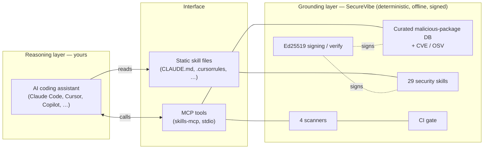
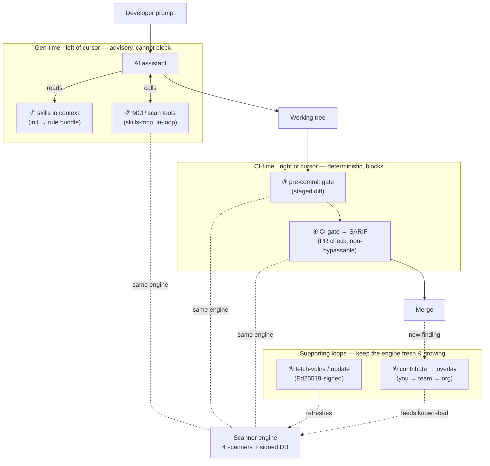
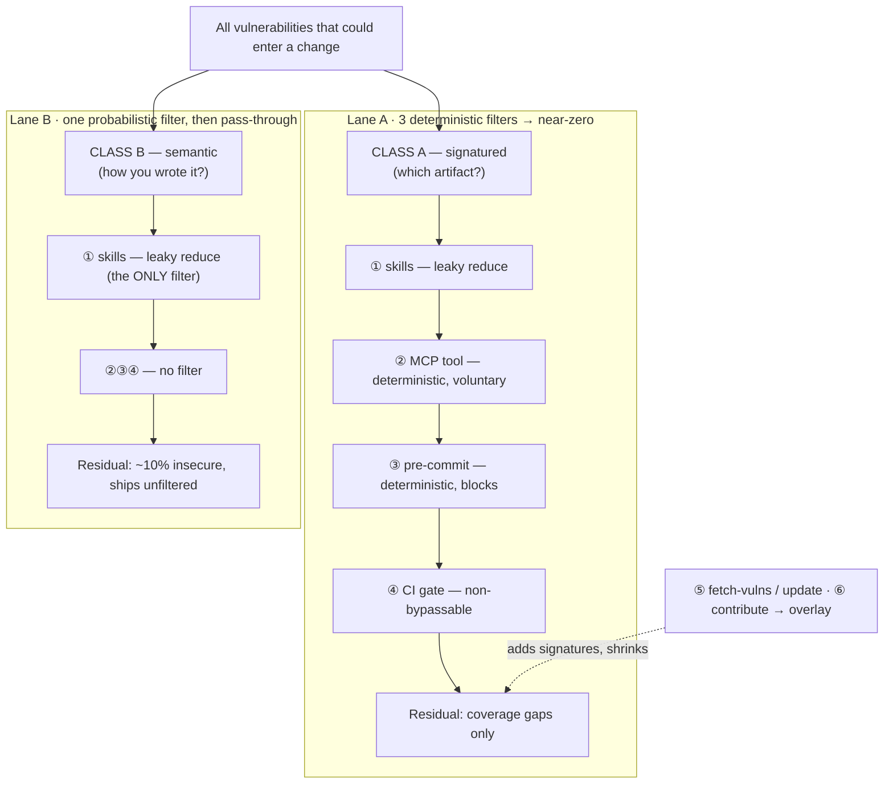
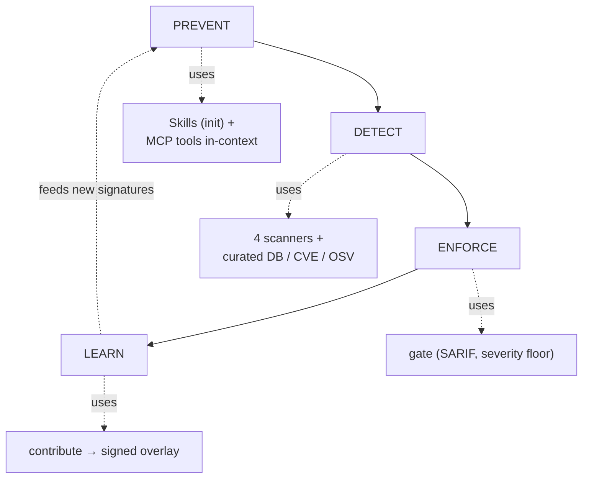
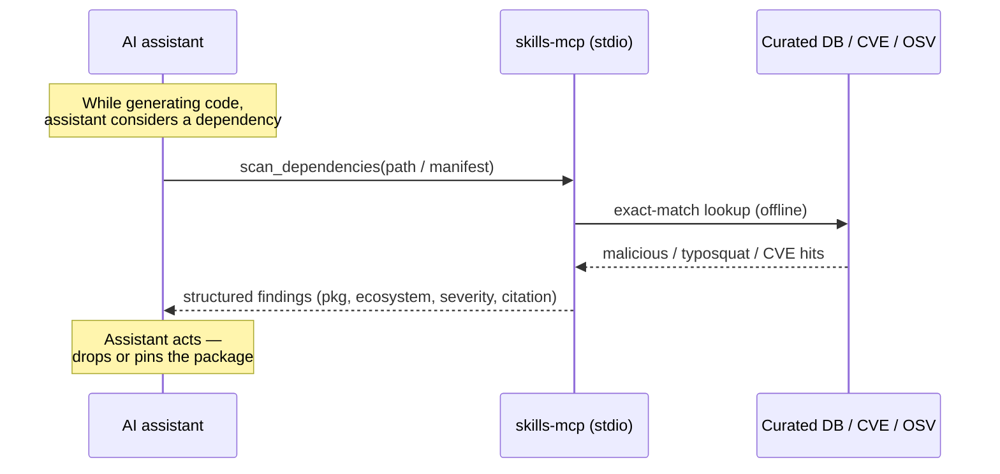

# Architecture

SecureVibe is a deterministic, fully offline *grounding* layer that feeds signed security knowledge and verifiable findings to your AI coding assistant — it never embeds or calls a model itself.

## The two-layer design

SecureVibe deliberately splits the system into two layers that meet at a narrow, well-defined interface.

- **The grounding layer (SecureVibe — the source of truth).** A deterministic Go core: the curated malicious-package database, the security skills, the four scanners, the Ed25519 signing/verification machinery, and the CI `gate`. Everything here is reproducible — the same input always produces the same output, and nothing requires a network or an API key.
- **The reasoning layer (your AI assistant).** Claude Code, Cursor, Copilot, Codex, Windsurf, Cline/OpenCode, Antigravity, or Devin. This is where natural-language understanding and code generation happen. SecureVibe **never embeds, bundles, or calls an LLM** — the model is supplied and run entirely by you.

SecureVibe is therefore **grounding plus orchestration**; the model is the reasoning engine. The two layers communicate only through static skill files and the MCP tool surface.

!!! note "Why keep the model out"
    Because the core is deterministic and keyless, every finding is reproducible and auditable, releases can be cryptographically signed, and the whole tool runs offline in CI. The trade-off is explicit: the core catches **known** patterns and **misses novel or semantic bugs** — that work belongs to the reasoning layer it grounds, not to SecureVibe.



## Four surfaces

SecureVibe plugs into a workflow through four distinct surfaces. The first two ground the assistant *before* code is written; the last two verify *after*.

| Surface | Component | How it connects | Primary command |
| --- | --- | --- | --- |
| Static skill files | `skills-check init` | Writes the assistant's native config so security knowledge is always in context | `skills-check init --tool claude` (also `cursor`, `copilot`, `codex`, `windsurf`, `cline`, `devin`) |
| MCP server | `skills-mcp` | Exposes **16 tools** over stdio; the assistant calls them on demand for live, deterministic lookups | `claude mcp add securevibe -- npx -y @namncqualgo/secure-code-mcp` |
| CLI scanners | `skills-check scan-*` | The four deterministic scanners, run by a human or a script | `skills-check scan-dependencies <path>` |
| CI gate | `skills-check gate` | Blocks insecure diffs in CI; auto-picks the scanner per file and emits SARIF | `skills-check gate <path> --min-severity high --sarif results.sarif` |

!!! tip "Surfaces compose"
    `init` puts the skills *in front of* generation, the MCP tools let the assistant *check itself* mid-task, the scanners give a human a manual pass, and the `gate` is the non-negotiable backstop in CI. You can adopt any subset.

The four scanners behind surfaces (c) and (d) are: **secrets**, **dependencies** (malicious / typosquat / CVE / OSV), **Dockerfile**, and **GitHub Actions**. Detection is **narrow by design** — this is not a general-purpose SAST and does not aim to find every vulnerability.

## Where it intercepts

This diagram shows **every point where SecureVibe hooks into the workflow and does its job** — from prompt to merge, plus the two loops that keep it fresh and growing. Hooks ① and ② act *before* code exists (gen-time, advisory); ③ and ④ re-check the artifact *after* (CI-time, deterministic, blocking); ⑤ and ⑥ feed the shared engine.



Points ②, ③ and ④ run the **same scanner engine** against the **same signed database** — they look similar because they *are* the same detection logic. They differ only in **who triggers them, on what scope, and whether the verdict can be ignored**:

| | ② MCP tool | ③ pre-commit | ④ CI gate |
| --- | --- | --- | --- |
| Triggered by | the model, voluntarily | git, on every commit | CI, on every push / PR |
| When | before the code exists | after it's written | on the final diff |
| Scope | one candidate dep / snippet | the staged diff | the whole change |
| Authority | advisory — model may ignore | blocks the commit (`--no-verify` to skip) | fails the check, non-bypassable |
| Self-corrects? | yes — model rewrites in-loop | no — blocks and reports | no — fails the build |

!!! note "Why the overlap is deliberate"
    Each layer assumes the previous one was skipped. ② is the cheapest fix — the model corrects itself before you ever see the bad line — but it only fires if the model *chooses* to call the tool and obeys the result, so it can be missed entirely (hand-written code, an assistant without the MCP server, or a model that simply didn't ask). ③ and ④ are the deterministic safety nets: they don't trust the model, they re-check the committed artifact, and they block. The same detection logic deployed at escalating authority is **defense in depth, not redundancy**.

    This applies only to the **deterministic** classes — dependencies, secrets, Dockerfile, GitHub Actions. Anything in your own source (SQL injection, SSRF, weak crypto) is reachable **only** by point ① (the skills) and has **no deterministic backstop** downstream, by design.

## The defense-in-depth funnel

Tracing the *pool* of possible vulnerabilities through those hooks shows the system isn't one funnel but **two parallel lanes** with very different filtering — and being explicit about which is which is central to how SecureVibe describes itself.



The split is by **detectability**, not severity:

- **Class A — signatured ("which artifact did you pull in?").** Malicious deps, typosquats, vulnerable deps (CVE / OSV), hardcoded secrets, Dockerfile and GitHub Actions misconfig. A signature exists, so the deterministic scanners can match it exactly.
- **Class B — semantic ("how did you write your own code?").** SQL injection, SSRF, code-level RCE, XSS, weak crypto, broken authorization. No signature exists; only the gen-time skill influences it.

| Filter | Lane A (signatured) | Lane B (semantic) |
| --- | --- | --- |
| ① skills (gen-time) | leaky reduce | **leaky reduce — the only filter** |
| ② MCP tool | deterministic, voluntary, self-correcting | — none |
| ③ pre-commit | deterministic, blocks | — none |
| ④ CI gate | deterministic, non-bypassable | — none |
| **End-state residual** | **coverage gaps only** (shrunk by ⑤ / ⑥) | **≈10% insecure** (single-model measured) |
| Failure mode | a *missing* signature | a *missed* prevention |

!!! warning "What the funnel means — read honestly"
    **Lane A is the moat.** Three redundant deterministic filters (②③④) mean a *known*-bad artifact is essentially guaranteed to be stopped at commit or CI, at zero false positives — a leak at one stage is caught at the next. Its only escape is a vuln with **no signature yet**, which is why the product's Lane-A investment is **data freshness and the contribution flywheel** (⑤ / ⑥), not a detection-rate percentage.

    **Lane B has no funnel** — one probabilistic gate at gen-time, then pass-through. Whatever the skill didn't prevent **ships**; the only lever is a better model or better skills (more lift at ①). Adding a deterministic Lane-B filter would mean becoming a general-purpose SAST, which SecureVibe deliberately is not.

    The two claims must never be conflated: *"we block known-bad deterministically"* (Lane A, true) is a different statement from *"we prevent SQL injection"* (Lane B, probabilistic — a relative reduction, not elimination; see [Benchmarks](benchmarks.md)).

## The lifecycle

The four stages map one-to-one onto components. (`ANALYZE` and `VERIFY` are future, demand-gated stages — they are not built today.)



| Stage | What happens | Component touched |
| --- | --- | --- |
| **PREVENT** | Signed skills sit in the assistant's context so it writes secure code at generation time | `init` config files, `skills-mcp` |
| **DETECT** | Deterministic scanners flag known issues with zero-false-positive exact-match lookups | 4 scanners, curated DB + CVE + OSV |
| **ENFORCE** | The gate fails the build above a severity floor and emits SARIF for GitHub Code Scanning | `skills-check gate` |
| **LEARN** | A new finding is captured into a signed overlay that feeds back into prevention/detection | `skills-check contribute`, `.skills-check/overlay.json` |

## An MCP request, end to end

When the assistant calls an `skills-mcp` tool, the work is a deterministic lookup — no model, no network beyond the local data the binary already carries.



Because the lookup is exact-match against the curated database, a hit is a true positive (the data moat is its zero-false-positive property); a miss simply means SecureVibe holds no signature for it, not that the package is proven safe.

## Repo layout

The top-level directories that matter for understanding the build:

```text
skills-library/
├── skills/                       # 29 security SKILL.md knowledge files (3 token tiers)
├── vulnerabilities/
│   ├── supply-chain/             # curated malicious-package DB (3,623 entries, 10 ecosystems)
│   ├── cve/                      # 58 CVE code-patterns
│   └── osv/                      # OSV-format vulnerability data
├── compliance/                   # SOC2 / HIPAA / PCI-DSS control mappings (*.yaml)
├── profiles/                     # enterprise profiles: financial-services / government / healthcare
├── rules/                        # 27 Sigma detection rules (cloud / container / endpoint / saas)
├── cmd/
│   ├── skills-check/             # the Go CLI: scanners, gate, init, contribute, self-update
│   └── skills-mcp/               # the MCP server (16 tools over stdio)
└── dist/                         # built/generated artifacts shipped with releases
```

!!! warning "Editing the curated DB"
    Changing anything under `vulnerabilities/**` requires regenerating the distributed artifacts (`skills-check regenerate`) — `dist/` carries a derived summary that local validation alone won't catch drifting.

## Trust & data integrity

Every layer of SecureVibe is verifiable without trusting a server.

- **Signed releases.** Each release ships a manifest carrying a **per-file SHA-256** checksum, plus a detached **Ed25519** signature over the manifest. The private signing key is held **offline**.
- **Verified self-update.** `skills-check self-update` fetches the signed manifest, verifies the **signature first, then the checksums**, and only then performs an **atomic rename** to replace the binary (crash-safe).
- **Signed contribution overlays.** `contribute add` writes a signed local `.skills-check/overlay.json`; import is **signature-gated** (`--allow-unsigned` is an explicit opt-in). Overlays fan out by scope: you (the file) → team (commit it; git is the distribution) → org (`$SKILLS_CHECK_OVERLAY` path-list env var).
- **Offline by construction.** No telemetry, no cloud dependency, no API key. Determinism plus signatures means findings are reproducible and the supply chain is auditable end to end.

See the [Developer guide](../guides/developer.md) for working on the core, or the [Quick start](../quickstart.md) to wire SecureVibe into an assistant.
