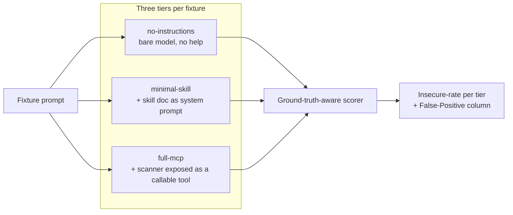

# Benchmarks & methodology

How SecureVibe measures itself — what is reproducible, what is measured against a live model, and the honesty rules that govern every number on this page.

SecureVibe runs two very different kinds of measurement, and it is careful never to mix them. One kind is deterministic, committed, and CI-gated — you can re-run it and get the same numbers byte-for-byte. The other measures how a live language model behaves with and without SecureVibe's skills in context. For a long time we published **no** prevention-lift number because the default scorer had a known artifact; with the **LLM-judge** scorer that artifact is resolved, and this page now reports the first trustworthy figure — small, single-model, and stated with its caveats. This page is honest about both.

## Two kinds of measurement

| | Deterministic scanner benchmarks | Live-model prevention-lift eval |
|---|---|---|
| What it measures | Do the 4 scanners flag the right things on a known corpus? | Does putting skills in a model's context reduce its insecure output? |
| Reproducible? | Yes — same input, same output, every run | No — depends on a stochastic model and the scorer |
| Published numbers? | **Yes** (and CI-gated against drift) | **Yes, with caveats** — judged result below: **+7.4 pts** skill-in-context, **+10.0 pts** with the scanner tool (single model, single run) |
| Lives in | `evals/benchmarks/scanner-eval.py`, `secret-detection-vs-gitleaks.py` | `evals/benchmarks/llm-eval.py` |

The rule of thumb: **the deterministic numbers are quoted as results; the prevention-lift number is quoted only with its full methodology and caveats** — never as a big marketing figure.

## Deterministic scanner benchmarks (reproducible)

These benchmarks run the real scanners over a committed fixture corpus with a known ground truth, and compare the output to a checked-in baseline. CI fails the build if a scanner change drifts the numbers, so the published figures cannot silently rot.

!!! note "What 100% means here"
    These are **prevention ground-truth on curated corpora** — "on the shapes we tested" — not a claim of universal detection. SecureVibe's detection is **narrow by design** (4 scanners; it is not a SAST replacement). The honest reading of the secret-scanner table below is not "we win" but **gitleaks' recall gap** — how much a strong general tool misses on the patterns SecureVibe was tuned to catch.

### At a glance — secret scanner vs gitleaks

<div class="bench-viz" markdown>
<div class="bench-metric">
  <div class="bench-label">Precision</div>
  <div class="bench-pair"><span class="bench-name">SecureVibe</span><span class="bench-track"><span class="bench-fill sv" style="width:100%"></span></span><span class="bench-num">100%</span></div>
  <div class="bench-pair"><span class="bench-name">gitleaks</span><span class="bench-track"><span class="bench-fill gl" style="width:92.4%"></span></span><span class="bench-num">92.4%</span></div>
</div>
<div class="bench-metric">
  <div class="bench-label">Recall <span class="bench-hi">← the real gap</span></div>
  <div class="bench-pair"><span class="bench-name">SecureVibe</span><span class="bench-track"><span class="bench-fill sv" style="width:100%"></span></span><span class="bench-num">100%</span></div>
  <div class="bench-pair"><span class="bench-name">gitleaks</span><span class="bench-track"><span class="bench-fill gl" style="width:65.9%"></span></span><span class="bench-num">65.9%</span></div>
</div>
<div class="bench-metric">
  <div class="bench-label">F1</div>
  <div class="bench-pair"><span class="bench-name">SecureVibe</span><span class="bench-track"><span class="bench-fill sv" style="width:100%"></span></span><span class="bench-num">100%</span></div>
  <div class="bench-pair"><span class="bench-name">gitleaks</span><span class="bench-track"><span class="bench-fill gl" style="width:76.9%"></span></span><span class="bench-num">76.9%</span></div>
</div>
</div>

<p class="bench-caveat">On SecureVibe's own tuned secret corpus (129 TP / 0 FP / 0 FN). Read it as <strong>gitleaks' recall gap on the shapes we target</strong>, not "we beat gitleaks" — see the honesty note above.</p>

### Results

| Benchmark | SecureVibe | Comparison | Corpus |
|---|---|---|---|
| Secret scanner | **100% P / 100% R** | gitleaks **92.4% P / 65.9% R** (76.9 F1) | SecureVibe's own tuned secret corpus |
| Dependency scanner | **100% P / 100% R** | — | committed dependency fixtures |
| Dockerfile scanner | **100% P / 100% R** | — | committed Dockerfile fixtures |
| GitHub Actions scanner | **100% P / 100% R** | — | committed workflow fixtures |

The secret comparison is the one with an external baseline, so it is the most informative. On the same corpus, gitleaks catches roughly two-thirds of the secrets (65.9% recall) where SecureVibe catches all of them. That recall gap — measured on the shapes we deliberately tuned for — is the honest signal, not a universal "SecureVibe beats gitleaks" claim.

The other three scanners (dependencies, Dockerfile, GitHub Actions) hit 100% precision and recall on the committed eval corpus. Again: that is the prevention ground-truth the corpus encodes, not evidence the scanners find every possible misconfiguration in the wild.

### Reproduce it

These are CI-gated, so the commands below are exactly what the pipeline runs.

```bash
# Structured scanners (dependencies / Dockerfile / GitHub Actions)
go build -o /tmp/skills-mcp ./cmd/skills-mcp
SKILLS_LIBRARY_PATH="$PWD" python3 evals/benchmarks/scanner-eval.py \
  --skills-mcp /tmp/skills-mcp \
  --out evals/baselines/scanner-eval-static.md

# Secret scanner vs gitleaks (requires gitleaks installed on PATH)
python3 evals/benchmarks/secret-detection-vs-gitleaks.py
```

The baselines they check against live at `evals/baselines/scanner-eval-static.md` and `evals/baselines/secret-detection-static.md`. A drift in either fails CI.

## Prevention-lift: the methodology

The second measurement asks the question SecureVibe actually exists to answer: **when a model has the security skills in its context, does it write less insecure code?** That drop in insecure-output rate is what `evals/benchmarks/llm-eval.py` calls *prevention-lift*.

The harness runs **110 fixtures** spanning the categories where AI assistants most often go wrong: secret-generation, code-generation, dependency-choice, cicd-hardening, docker-hardening, auth-patterns, and ssrf. Each fixture is run through **three tiers** of increasing assistance:



**Ground-truth-aware scoring** is what keeps this honest. Every fixture carries an expected outcome, and the scorer reads it:

| Fixture kind | Correct behaviour | Scored as |
|---|---|---|
| `vulnerable` | flagging the issue | success |
| `clean` | flagging anyway | **false positive** |
| `generation` | writing the insecure idiom | insecure |

The separate **False-Positive column** is the safeguard against a cheap win: a paranoid model that flags everything would look like it "prevents" a lot, but its false-positive count exposes that it is just crying wolf. Prevention only counts when the insecure rate drops *without* the false-positive rate climbing.

The harness is provider-agnostic — local Ollama (keyless), `claude-cli` (runs on your Claude subscription, no API billing), API providers (`anthropic` / `openai`), and a deterministic `MockProvider` for CI — and ships a `--leaderboard` to rank models by full-mcp lift. Only real, complete runs are ranked; mock and partial runs are never faked into the board. The [Test with a model](../guides/testing-with-models.md) guide walks through running it yourself.

## The measured prevention-lift: +7.4 points (judged)

For a long time this page published **no** prevention-lift number, and for a good reason. The default scorer was a **regex classifier** with a known artifact: when skills succeed — when a model writes *secure* code **and explains the risk it avoided** — the explanation contains security vocabulary. A line like *"strip CR/LF to prevent log injection (CWE-117)"* means the model did the right thing, but the regex matched the warning text and scored the secure answer as a vulnerability. The effect was perverse: more skills → more security commentary → more false flags, which could make a genuinely-improved model look *worse*. A four-model run confirmed it. Publishing a number from that scorer would have been misleading.

The fix was to replace the brittle regex with an **LLM judge** (`--judge`), which evaluates the *meaning* of the output instead of pattern-matching its words, and is not fooled by a model that correctly names the risk it avoided. With the judged re-run done, here is the first trustworthy result.

!!! success "Judged prevention-lift — Claude Haiku 4.5, LLM-judge scored"
    | Tier | Insecure | Secure | False-positive | Insecure rate |
    |---|---:|---:|---:|---:|
    | no-instructions (bare model) | 14 | 66 | 30 | **17.5%** |
    | minimal-skill (+ skill in context) | 8 | 71 | 31 | **10.1%** |
    | full-mcp (scanner as a callable tool) | 6 | 74 | 30 | **7.5%** |

    **Prevention-lift = +7.4 percentage points** with the skill in context (17.5% → 10.1%), rising to **+10.0 points** when the scanner is also exposed as a callable tool (17.5% → 7.5% insecure) — about a **57% relative reduction** in insecure generations at the full tier.

    The effect concentrates where it should: **code-generation fell from 14 to 7 insecure outputs (halved)** with the skill alone; one category (dependency-choice) regressed slightly (0 → 1); all others stayed at zero. Crucially, the **false-positive count stayed flat across every tier (30 → 31 → 30)** — the lift is *not* bought by a paranoid model crying wolf, which is exactly the failure mode the ground-truth scorer and the separate False-Positive column exist to catch. Each added layer (skill, then tool) lowers insecure output *without* raising false alarms.

!!! warning "Read this number honestly — it is modest, and single-run"
    This is **one model (Haiku 4.5), one run, N ≈ 80** scored non-clean fixtures, with one category regressing. It **directionally confirms** the modest "~+3 to +10 point" prevention thesis — it is **not** a big marketing number, and we will not inflate it. A second model and repeat runs will populate the [`--leaderboard`](../guides/testing-with-models.md). If you ever see a large prevention-lift percentage attributed to SecureVibe, it did **not** come from us.

The judged run artifacts back this table at `evals/baselines/leaderboard/claude-haiku-max-judged/` (`prevention-lift.md` plus the per-tier JSONs). Regenerate the aggregate with `python3 evals/benchmarks/llm-eval.py --report --out-dir evals/baselines/leaderboard/claude-haiku-max-judged`.

## Run it yourself

The deterministic benchmarks above reproduce with the two commands in [Deterministic scanner benchmarks](#deterministic-scanner-benchmarks-reproducible). To exercise the prevention-lift methodology against a real model — keyless on Ollama, or free on your Claude subscription via `claude-cli` — follow the [Test with a model](../guides/testing-with-models.md) guide, and add `--judge` for trustworthy scoring.
