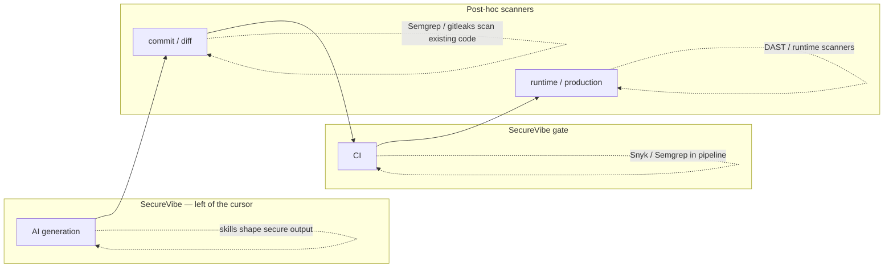

# How SecureVibe compares

SecureVibe prevents insecure code at generation time; Semgrep, Snyk, and gitleaks detect insecure code after it already exists — they sit in different lanes and work best together.

## The category difference

The question "isn't this just another Semgrep/Snyk/gitleaks?" assumes everyone is doing the same job. They aren't.

- **SecureVibe is PREVENTION**, "left of the cursor". Its product is signed security **skills** fed into AI coding assistants so they write secure code at GENERATION time, backed by a deterministic `gate` that blocks insecure diffs in CI.
- **Semgrep / Snyk / gitleaks are post-hoc DETECTION.** They scan code that already exists — in your repo, your dependency tree, or your CI artifacts. They are excellent at that, with far broader rule coverage than SecureVibe.

These are complementary, not substitutes. Prevention reduces how many issues get written; detection catches what slips through. You want both.

SecureVibe acts at the leftmost point (generation) and again at the gate. The incumbents act from commit rightward. Only SecureVibe occupies the generation lane.

## Feature comparison

This is an honest, side-by-side view. SecureVibe's detection is **narrow by design** — four scanners, not a general SAST/SCA suite. Where the incumbents are broader, the table says so plainly.

| Capability | SecureVibe | Post-hoc scanners (Semgrep / Snyk / gitleaks) |
|---|---|---|
| **Gen-time prevention** (left of the cursor) | Yes — signed skills feed AI assistants so they write secure code as it's generated | No — they scan code that already exists |
| **Deterministic CI gate** | Yes — `skills-check gate` exits non-zero above a severity floor, emits SARIF, auto-picks the scanner per file | Varies — most can fail CI; comparable in spirit |
| **Secret detection** | Yes — 100% precision / 100% recall vs gitleaks 92.4% / 65.9% (76.9 F1) **on the shapes we tested** (SecureVibe's own tuned corpus); the honest signal is gitleaks' recall gap, not a universal win | Yes — gitleaks et al. are mature, broad secret scanners |
| **Malicious-dependency DB** | Yes — curated 3,623 entries across 10 ecosystems, every entry web-cited; exact-match lookups = zero false positives | Yes — Snyk and others ship large vulnerability/SCA databases (far larger general CVE coverage) |
| **General SAST breadth** | **No — narrow by design** (4 scanners: secrets, dependencies, Dockerfile, GitHub Actions). Not a SAST replacement | **Yes — much broader.** Semgrep/Snyk cover many languages and rule classes SecureVibe does not |
| **Offline / no telemetry** | Yes — fully offline, no telemetry, no API key required | Varies — several have cloud/SaaS modes and telemetry |
| **Signed releases** | Yes — Ed25519-signed releases; self-update verifies signature + SHA-256 checksums before atomic replace | Varies by vendor |
| **License** | MIT, open core (paid = scale + trust-infra only; a fix is never paywalled) | Mixed (OSS, freemium, and commercial tiers) |

!!! note "Read the table fairly"
    SecureVibe is not trying to out-cover Semgrep or out-database Snyk — that is explicitly **not its game**. Incumbents have far broader SAST and SCA coverage. SecureVibe's distinct contribution is the generation-time lane plus a deterministic gate, and a curated exact-match malicious-package DB with zero false positives.

## What SecureVibe is NOT

!!! warning "Honest boundaries"
    - **Not a general SAST.** Detection is narrow by design — four deterministic scanners (secrets, dependencies, Dockerfile, GitHub Actions). It will not find every vulnerability class.
    - **Not an SCA replacement.** The malicious-package DB is curated and exact-match (a zero-false-positive moat), not a comprehensive CVE/SCA catalog like Snyk's.
    - **Not a runtime / DAST tool.** It does not exercise a running application or test live endpoints.
    - **Catches known patterns, misses novel/semantic bugs.** The keyless scanners match known shapes; they will miss novel or semantic vulnerabilities. That is the accepted trade-off for being deterministic, offline, and false-positive-resistant.

## Use them together

The recommended posture is not "SecureVibe instead of your scanners" — it's **SecureVibe in front of them**.

1. **At generation time**, install SecureVibe's skills into your AI assistant (`skills-check init --tool <claude|cursor|copilot|...>`) so the model writes secure code in the first place.
2. **At the gate**, run `skills-check gate <path> --min-severity high --sarif results.sarif` in CI to block insecure diffs deterministically and feed GitHub Code Scanning.
3. **For breadth and runtime**, keep your existing tools — Semgrep/Snyk for wide SAST/SCA coverage, gitleaks for secrets at scale, and your DAST/runtime scanners for production. SecureVibe does not replace these.

!!! tip "The short version"
    SecureVibe shrinks the number of insecure lines that ever get written and gives you a deterministic CI gate for a few high-value classes. Your existing scanners stay in place for everything else. Prevention plus detection beats either alone.

See also: [Quick start](../quickstart.md) · [Developer guide](../guides/developer.md) · [Benchmarks](benchmarks.md)
