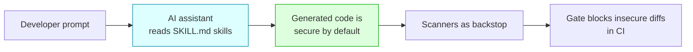
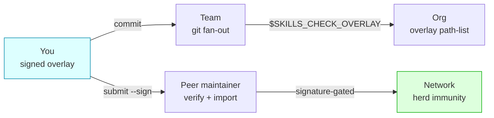

# What makes SecureVibe different

SecureVibe occupies the one security lane that scanners structurally can't reach: it makes secure code the *default the AI writes*, then backs that up with deterministic scanners, a signed community DB, and an offline, tamper-evident trust model.

Most tools wait for code to exist and then look for what's wrong. SecureVibe starts earlier — "left of the cursor" — and shapes the code as it's generated. Everything below is a distinct, real capability in this repo. Each one comes with an honest limit.

---

## 1. Generation-time skills (PREVENT)

**What it is.** 29 signed `SKILL.md` documents — structured security knowledge in three token tiers (`minimal` / `compact` / `full`) so an assistant can load the right depth for its context budget. `skills-check init` writes the matching config for your assistant (`CLAUDE.md`, `.cursorrules`, `.github/copilot-instructions.md`, `AGENTS.md`, and others), and the assistant reads the skills *while it writes code*.

**Why it matters.** This is the lane that post-hoc tools structurally cannot occupy. Semgrep, Snyk, and gitleaks all run *after* the code exists — they can only tell you what's already wrong. SecureVibe moves the security knowledge to generation time, so "secure" is the path of least resistance the model takes in the first place. The cheapest vulnerability is the one never written.



| | SecureVibe (prevention) | Semgrep / Snyk / gitleaks (post-hoc) |
| --- | --- | --- |
| **When it acts** | At generation time, before code exists | After code is written / committed |
| **Primary surface** | The assistant's output | A finished diff or repo |
| **Failure mode it fixes** | The vuln is never authored | The vuln is found, then must be fixed |
| **Can the other lane do this?** | — | No — structurally post-hoc |

!!! note "Honest limit"
    Prevention is guidance, not a guarantee. The assistant *should* write more secure code with the skills loaded, but it can still ignore or misapply them — which is exactly why the scanners and the `gate` exist as a backstop.

---

## 2. Zero-false-positive curated DB

**What it is.** A curated malicious-package database of **2,022 entries across 9 ecosystems** (npm 688, nuget 608, pypi 309, rubygems 309, plus curated composer / crates / docker / maven / go / github-actions). Every curated entry is web-cited. Lookups are exact-match, so a hit means a *known* bad package — never a guess.

**Why it matters.** Exact-match against a hand-verified list means **zero false positives**. The primary use is at generation time: "about to import this dependency?" — the assistant or the `scan-dependencies` scanner can check the name before the import lands. A curated, cited list is the data moat — it's defensible because it's verified, not scraped.

**Why it works as a moat.** A small, web-cited, exact-match list is something a heuristic scanner can't fake: there are no near-misses to argue about, and every entry has a citation behind it.

!!! warning "Honest limit"
    This is **curated known-bad data, not an all-knowing SCA**. It catches packages someone has already verified and listed — it does not discover novel malicious packages on its own. It is **not** marketed as "our DB vs Snyk's"; it is a precise, zero-FP exact-match layer that feeds prevention, not a comprehensive supply-chain replacement.

---

## 3. The LEARN / contribution loop

**What it is.** A signed flywheel for turning one person's finding into shared protection. You add a package locally; it propagates outward through three scopes.

1. **You** — `skills-check contribute add -p <pkg> -e <npm|pypi|...>` writes a **signed** local overlay at `.skills-check/overlay.json`. The gate blocks that package on the next run.
2. **Team** — commit the overlay file. Git is the fan-out; everyone on the repo inherits the block.
3. **Org** — point `$SKILLS_CHECK_OVERLAY` at a path-list of overlays to layer team → org coverage.
4. **Peer-to-peer** — `contribute submit --sign` produces a signed contribution; a maintainer runs `contribute verify` then `contribute import`. Import is **signature-gated** (`--allow-unsigned` is an explicit opt-in). Keys come from `contribute keygen`.

**Why it matters.** This is the defensible flywheel. Every block one person adds can become herd immunity for their team, their org, and the wider network — and because every step is signed, trust scales without a central server. The more it's used, the more it's worth, and the data stays verifiable end to end.



!!! tip "Honest limit"
    The loop's value is proportional to participation, and there are **no production users yet** — the flywheel is built and signature-safe, but it hasn't spun up at scale. The mechanism is real; the network effect is still ahead.

---

## 4. Signed self-update

**What it is.** `skills-check self-update` fetches a signed release manifest and verifies it before touching anything: it checks a **detached Ed25519 signature** against the binary's embedded public key, then verifies **SHA-256 checksums** per file, then performs an **atomic rename** (crash-safe). The private signing key is held offline.

**Why it matters.** A security tool that updates itself is a supply-chain target. SecureVibe applies its own trust model to its own updates: nothing is replaced unless both the signature and the checksum pass, so a tampered or man-in-the-middle'd release is rejected rather than installed. It works offline and requires no API key.

| Step | Check | On failure |
| --- | --- | --- |
| 1 | Detached Ed25519 signature vs embedded public key | Abort — no replacement |
| 2 | SHA-256 checksum per file | Abort — no replacement |
| 3 | Atomic rename of the binary | Crash-safe; old binary intact |

!!! note "Honest limit"
    Signed self-update guarantees the integrity of *what you receive*, not the absence of bugs in *what was signed*. It proves the release came from the holder of the offline key unmodified — it can't vouch for code the key-holder shipped in good faith.

---

## 5. Four high-precision scanners

**What it is.** Deterministic, offline scanners for the four highest-signal shapes: **secrets**, **dependencies** (malicious / typosquat / CVE / OSV), **Dockerfile**, and **GitHub Actions**. They run via `scan-secrets`, `scan-dependencies`, `scan-dockerfile`, `scan-github-actions`, and the `gate` auto-picks the right scanner per file.

**Why it matters.** Where they fire, they fire precisely — and precision is what makes a gate usable in CI without drowning developers in noise. The measured results:

- **Secret scanner: 100% precision / 100% recall** versus gitleaks' 92.4% / 65.9% (76.9 F1) — **on SecureVibe's own tuned corpus ("on the shapes we tested")**. The honest signal here is gitleaks' *recall gap*, not a universal claim of superiority.
- **The three structured scanners (deps / Dockerfile / GitHub Actions): 100% precision / recall on the committed eval corpus** — this is **prevention ground-truth on a fixed corpus, not a claim of universal detection**.

!!! warning "Honest limit"
    Detection is **narrow by design** — four scanners, not a general-purpose SAST. The numbers above are measured on *our* corpora and shapes; they are not universal benchmarks. The tool catches **known patterns** and **misses novel or semantic bugs** — that's the accepted, deliberate trade-off of a deterministic keyless scanner.

---

## 6. MCP-native

**What it is.** `skills-mcp` exposes **16 tools** over stdio that an assistant can call on demand — including `scan_dependencies`, `scan_secrets`, `scan_dockerfile`, `scan_github_actions`, `lookup_vulnerability`, `check_secret_pattern`, `map_compliance_control`, and `gate`. Add it to Claude Code with:

```bash
claude mcp add securevibe -- npx -y @namncqualgo/secure-code-mcp
```

**Why it matters.** Because the capabilities are MCP tools, the assistant invokes them *as part of its own reasoning loop* — checking a dependency or running the gate mid-task rather than waiting for a separate CI step. It works across **8 assistants**: Claude Code, Cursor, GitHub Copilot, Codex, Windsurf, Cline/OpenCode, Antigravity, and Devin.

!!! note "Honest limit"
    MCP makes the scanners callable, but it doesn't widen what they detect — the same narrow-by-design coverage applies whether a tool is invoked over MCP or from the CLI.

---

## 7. Offline, MIT, signed

**What it is.** SecureVibe is **MIT-licensed**, **fully offline**, and **Ed25519-signed**. There is **no telemetry, no cloud dependency, and no API key required**.

**Why it matters.** Security tooling that phones home is itself a risk surface. SecureVibe runs entirely on your machine, sends nothing anywhere, and ships with verifiable signatures — so you can audit it, run it in an air-gapped environment, and trust the bytes you got. The open-core boundary is honest: the paid surface is **scale and trust-infrastructure** (a central signing pipeline, a private registry, fleet policy, SLAs) — **never** a paywalled security fix.

!!! note "Honest limit"
    Offline and keyless means the tool has only what's bundled or in your overlays — there is no live cloud lookup pulling the latest intelligence on every run. Freshness is your responsibility (`skills-check status --fail-if-stale`, `update` / `fetch-vulns`).

---

!!! warning "Honest about the limits"
    SecureVibe is deliberately narrow. Detection is **four scanners by design**, not a comprehensive SAST and not a replacement for one. It catches **known patterns** and **misses novel or semantic vulnerabilities** — the accepted trade-off of a deterministic, keyless, offline tool. The measured results above are on *our* corpora and shapes, not universal benchmarks. And the project has **no production users yet**: the prevention lane, the signed DB, and the contribution flywheel are real and built, but the network effects they're designed for are still ahead. What's special here is the *lane* — prevention at generation time, backed by verifiable, offline, signed trust infrastructure — not a claim to catch everything.
