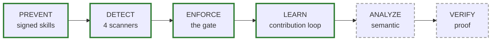

# Roadmap

Where SecureVibe is today, where it might go, and the honest constraint that decides what gets built next.

## The defense lifecycle

SecureVibe is organized around a six-stage model for securing AI-written code. Four stages are shipped; two are deliberately unbuilt and gated on real demand.

| Stage | Status | What it means |
|-------|--------|---------------|
| **PREVENT** | ✅ Shipped | Signed security skills feed AI assistants secure idioms at generation time — "left of the cursor." |
| **DETECT** | ✅ Shipped, **narrow by design** | 4 deterministic scanners (secrets, dependencies, Dockerfile, GitHub Actions). Not a general SAST. |
| **ENFORCE** | ✅ Shipped | The `gate` blocks insecure diffs in CI, exits non-zero above a severity floor, emits SARIF. |
| **LEARN** | ✅ Shipped | Signed contribution overlays close the loop: a new finding becomes a blocking rule on the next run. |
| **ANALYZE** | ❌ Not built — future | Semantic understanding of code beyond known patterns. Demand-gated (see below). |
| **VERIFY** | ❌ Not built — future | Proof that a fix actually holds. Demand-gated (see below). |

!!! warning "What "shipped" means here"
    PREVENT, DETECT, ENFORCE, and LEARN are real, tested, and in the release. ANALYZE and VERIFY are **not built** — they are directions under consideration, not committed work, and carry no dates.

## Shipped today

Everything below ships in the current release. It is fully offline, requires no API key, and arrives as Ed25519-signed binaries.

- **29 skills** — structured `SKILL.md` knowledge in 3 token tiers (minimal / compact / full) for feeding AI assistants at generation time.
- **4 deterministic scanners** — secrets, dependencies (malicious / typosquat / CVE / OSV), Dockerfile, GitHub Actions. Narrow by design.
- **16 MCP tools** — `scan_dependencies`, `scan_secrets`, `scan_dockerfile`, `scan_github_actions`, `lookup_vulnerability`, `check_secret_pattern`, `map_compliance_control`, `gate`, and more, exposed over stdio by `skills-mcp`.
- **Curated malicious-package DB — 2,022 entries across 9 ecosystems** (npm, nuget, pypi, rubygems, plus curated composer/crates/docker/maven/go/github-actions). Every curated entry is web-cited; exact-match lookups carry zero false positives. This is the data moat.
- **The LEARN loop** — `contribute add` writes a signed local overlay that the gate enforces immediately; share it by committing (team) or peer-to-peer via signature-gated `submit`/`verify`/`import`.
- **Signed self-update** — `self-update` fetches a signed release manifest, verifies the detached Ed25519 signature and SHA-256 checksums, then atomically replaces the binary.
- **Compliance evidence** — control-coverage reports mapped to **SOC 2, PCI-DSS, and HIPAA**, with enterprise profiles for financial-services, government, and healthcare.
- **8 assistant integrations** — Claude Code, Cursor, GitHub Copilot, Codex, Windsurf, Cline/OpenCode, Antigravity, and Devin, each wired up with one `init` command.
- **Offline and signed** — no telemetry, no cloud dependency, no API key; releases are Ed25519-signed with the private key held offline.

## Under consideration (demand-gated)

!!! note "These are NOT built"
    Nothing in this section ships today. Each item is a direction we would build **only on real demand**. There are no promised dates, versions, or milestones.

- **Semantic ANALYZE / VERIFY using your own model.** Today's scanners catch known patterns and miss novel or semantic bugs — that is the accepted trade-off of a keyless, deterministic tool. A future ANALYZE/VERIFY stage would add semantic reasoning, but **the project never embeds an LLM**: it would run against *your* model (your subscription or key), preserving the offline, no-vendor-lock posture.
- **A strict admission gate before anything reaches the curated DB.** The curated DB's value is that exact-match lookups are zero-false-positive. Any semantic or model-derived candidate would have to pass a strict admission gate — it does not get to dilute the canon. The moat is the discipline, not the volume.
- **A central candidate → canon signing pipeline.** A future maintainer-side pipeline could take community candidates, verify and sign them, and promote them into the canonical signed DB. This is the kind of scale-and-trust infrastructure that sits on the paid side of the open-core line — **never a security fix**, which is always free.

## How priorities are set

We are honest about the binding constraint: **adoption**. There are **no production users yet**. That single fact reorders everything.

- **Distribution beats new features.** A scanner nobody runs prevents nothing. Until there is real adoption, effort goes toward making SecureVibe easy to find, trust, install, and wire into an existing workflow — not toward expanding the feature surface.
- **Coverage stays deliberately narrow.** Detection is 4 scanners on purpose. Chasing general-SAST breadth is the "worse Semgrep" trap: a wide, shallow scanner that competes badly with mature tools and dilutes the one thing SecureVibe does that incumbents structurally can't — security at generation time, backed by a zero-false-positive curated DB.
- **Demand gates the speculative work.** ANALYZE and VERIFY stay on the shelf until users ask for them with their feet. Building them before that would be guessing.

## Want to shape it?

The roadmap is set by what users actually need, so the most useful thing you can do is tell us.

- Read the [Contributor guide](../guides/contributor.md) to add a malicious-package entry, a scanner case, or a skill.
- Open or comment on a [GitHub issue](https://github.com/nguyencongnamit/skills-library/issues) to argue for a direction — especially if you'd use ANALYZE or VERIFY.
