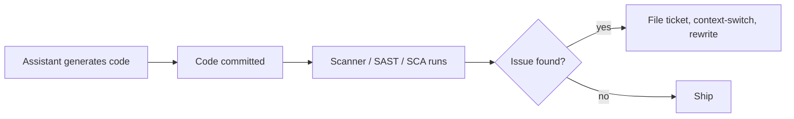
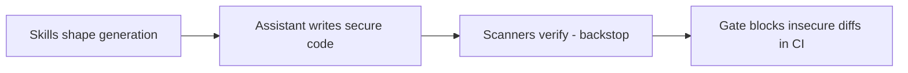
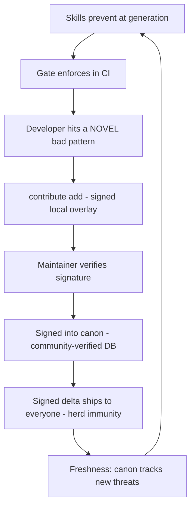

# Why SecureVibe

**SecureVibe shapes what an AI coding assistant writes at generation time — a lane that post-hoc scanners structurally cannot occupy — and turns every novel bad pattern a developer hits into a signed, community-verified defense for everyone.**

## The problem

AI coding assistants now write a large and growing share of the code that ships. They are fast, fluent, and — because they generalize from public code — they reproduce the same insecure patterns over and over:

- **Hardcoded secrets** baked into source, config, and example files.
- **Unpinned CI**: GitHub Actions referenced by mutable tag instead of a pinned commit SHA.
- **`curl | sh`** install steps and other unauthenticated remote-execution patterns.
- **Malicious or typosquatted dependencies** — a name one keystroke away from a popular package, or a package whose maintainer was compromised.

These are not exotic, novel-research bugs. They are *known shapes*, repeated at machine speed.

The structural problem is **timing**. Almost all security tooling runs *after* the code already exists:

By the time Semgrep, Snyk, or gitleaks see the code, the insecure pattern is already written, reviewed-around, and often merged. The tool's job becomes *cleanup*. Every loop pays the cost of writing the wrong thing first.

## The insight

Move security **left of the cursor**: shape what the assistant writes *at the moment it writes it*.

SecureVibe feeds AI coding assistants signed, structured security **skills** — `SKILL.md` knowledge that tells the model the secure way to do the thing it is about to do — so the insecure pattern is never generated in the first place. Deterministic scanners back this up as a backstop, and a `gate` blocks insecure diffs in CI when prevention is bypassed.

This is a lane that post-hoc scanners **structurally cannot occupy**. Semgrep, Snyk, and gitleaks operate on code that already exists — that is their entire model. They have no presence at the cursor, no influence on the token the model is about to emit. SecureVibe is not a better scanner competing on the same ground; it operates one step earlier, where the others cannot reach.

!!! note "Prevention is the product; detection is the backstop"
    The lifecycle is **PREVENT** (skills) → **DETECT** (4 scanners) → **ENFORCE** (gate) → **LEARN** (contribution loop). The scanners are deliberately **narrow by design** — secrets, dependencies, Dockerfile, GitHub Actions — not a general SAST. They exist to catch the known shapes that slip past prevention, not to find every vulnerability.

## The moat — a flywheel, not a feature

The scanners are copyable. Anyone can write a regex for an AWS key or a check for an unpinned action. If the scanners were the product, there would be no moat.

The defensible asset is the **flywheel** that turns usage into a continuously fresher, community-verified, *signed* canon of bad patterns:

1. **Skills prevent** — the assistant writes secure code by default.
2. **The gate enforces** — insecure diffs are blocked in CI.
3. **A developer hits a novel bad pattern** — a new typosquat, a freshly-disclosed malicious package, a pattern not yet in canon.
4. **They contribute it** — `skills-check contribute add` writes a signed local overlay that blocks the pattern for them immediately.
5. **It is signed into canon** — the contribution is submitted, a maintainer verifies the signature, and it is imported into the shared, signed pattern database.
6. **A signed delta protects everyone** — the next `self-update` or overlay sync carries that pattern to every user. One developer's novel hit becomes the whole community's **herd immunity**, and the canon stays fresh as new threats appear.

The **spin rate** of this flywheel is, qualitatively:

> spin rate ≈ users × novel-hit-rate × submit-conversion

More users surface more novel patterns; a higher submit-conversion turns more of those hits into shared defenses; freshness compounds.

Crucially, **the defensible value accrues at "sign into canon"** — the signed, community-verified pattern database and the trust pipeline that gates what enters it. That asset is *not* copyable by cloning the scanners, because it is made of:

- **Curated, web-cited entries** — every malicious-package record carries a citation. Exact-match lookups against curated data yield **zero false positives**, which is what makes the data trustworthy enough to gate a build on.
- **A signature-gated trust pipeline** — contributions are Ed25519-signed; import is signature-gated. The canon's integrity, not just its contents, is the moat.
- **Freshness as a flow, not a snapshot** — a copied database is stale the day it is copied. The flywheel is the only way to keep the canon current.

!!! note "The current canon"
    Today the curated malicious-package database holds **3,623 web-cited entries across 10 ecosystems** (npm, nuget, pypi, rubygems, plus curated composer, crates, docker, maven, go, and github-actions), alongside 27 Sigma rules, 74 secret-detection patterns, and 58 CVE code-patterns. These are the starting canon the flywheel is built to grow — not the ceiling.

## Open-core boundary

A security **fix is never paywalled**. Every pattern that protects a developer — every signed delta, every malicious-package entry, every skill — flows to everyone. Gating a security fix behind a paywall would break the herd immunity that makes the flywheel valuable in the first place.

What could ever be paid is **scale and trust-infrastructure**, never the protection itself. This maps cleanly onto the overlay scopes — the **user → team → org** rings:

| Ring | Mechanism | Boundary |
|------|-----------|----------|
| **You** | `.skills-check/overlay.json` — your signed local overlay | Always free, fully offline |
| **Team** | Commit the overlay; git is the fan-out | Always free — it's just a file in your repo |
| **Org** | `$SKILLS_CHECK_OVERLAY` path-list; central signing, private registry, fleet policy, SLAs | Where managed scale + trust-infra could be paid |

Open-core paid surface, if any, is the **central signing pipeline, private registry, fleet policy, and SLAs** — the infrastructure of running this at organizational scale with managed trust. The core tool stays MIT, fully offline, with no telemetry, no cloud dependency, and no API key required.

## Honest status

!!! warning "The binding constraint today is adoption, not technology"
    SecureVibe has **no production users yet**. At zero users, the flywheel is **stationary** — there are no novel hits to contribute, so nothing spins. That makes **distribution upstream of everything**: the moat is real in design but unproven in motion, and it stays unproven until people are using the tool and feeding the canon.

Two things must be held separately and honestly:

- **The technology is real and measured.** It works, it's signed, it's offline, and the prevention path has been evaluated:
    - The **secret scanner** measured **100% precision / 100% recall** versus gitleaks' 92.4% / 65.9% (76.9 F1) — **on SecureVibe's own tuned corpus ("on the shapes we tested")**. The honest signal here is *gitleaks' recall gap on these shapes*, not a universal claim that SecureVibe finds every secret.
    - The **three structured scanners** (dependencies, Dockerfile, GitHub Actions) measured **100% precision / recall on the committed eval corpus** — this is **prevention ground-truth on a known corpus, not a claim of universal detection**.
- **The growth is unproven.** No users, no customers, no stars, no downloads, no revenue — and nothing on this page invents them. The flywheel argument above is a *thesis*, argued qualitatively. It becomes a moat only once the wheel is turning.

!!! note "What is deliberately not claimed"
    Detection is **narrow by design** — four scanners, not a SAST replacement, and not "comprehensive". The keyless tool catches **known patterns** and **misses novel and semantic bugs** by design; that is the accepted trade-off for a deterministic, offline, zero-false-positive backstop. The right mental model is *prevention first, narrow deterministic detection second* — and a flywheel that, with adoption, makes the narrow part progressively less narrow.
