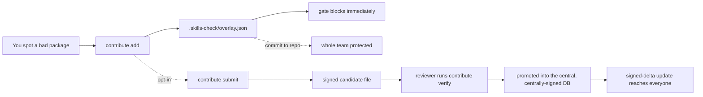

# Contribute a finding (the LEARN loop)

When you discover a bad package — one that beacons out in CI, exfiltrates
environment variables in a `postinstall`, or is an obvious typosquat the
curated database doesn't know yet — you shouldn't have to wait for anyone to
review it before your own builds are protected. `skills-check contribute`
records the finding into a **local overlay** so the gate blocks it on the very
next run. The rule never leaves your machine unless you explicitly choose to
share it.

This is the "left of the cursor, and now left of the *database*" half of
vibe-guard: prevention that you can extend the moment you learn something,
without a round trip.

## The model



- **Private by default.** `contribute add` writes only to
  `.skills-check/overlay.json` in your project. Nothing is uploaded.
- **Team-wide with one commit.** Commit that file and every teammate (and your
  CI) enforces the same block — herd immunity within a repo.
- **Upstream only on `submit`.** The *only* artifact that ever leaves the
  machine is the candidate file you produce with `contribute submit`, and only
  when you run it. Sign it so a reviewer can verify provenance before promoting
  a rule into the canonical database.
- **Canon stays central.** Candidates are untrusted input. A rule becomes
  canonical only after review and a signature from the central release key —
  the same key that signs every `update`. You crowdsource *candidates*, never
  *canon*.

## Block a package locally

```bash
# Block a package you saw misbehave — everywhere, immediately:
skills-check contribute add -p evil-pkg -e npm \
  --reason "exfiltrates AWS creds in a postinstall script"

# The next gate run fails on it:
skills-check gate package.json --severity-floor high   # exit 1
```

By default the block applies to **all versions** at **high** severity (so it
fails the default gate floor). Narrow it when you know more:

```bash
skills-check contribute add -p left-pad -e npm \
  --versions 1.0.0,1.1.0 --severity critical \
  --references https://example.com/advisory
```

Manage the overlay:

```bash
skills-check contribute list                 # show every local rule
skills-check contribute remove -p evil-pkg -e npm
```

Findings sourced from the overlay are labelled with confidence **high** and
`source: local-overlay`, so they are honestly distinguished from
centrally-reviewed canon in every report.

## Sign and share a candidate

Signing needs an Ed25519 key. You don't need `openssl` — generate one:

```bash
skills-check contribute keygen --out ~/.vibe-guard-contrib.pem
# Wrote private key (0600) + public key; prints the Key ID.
```

Then sign as you record, and export a portable candidate:

```bash
skills-check contribute add -p evil-pkg -e npm \
  --reason "..." --key ~/.vibe-guard-contrib.pem

skills-check contribute submit \
  --key ~/.vibe-guard-contrib.pem --out candidate.json
```

`candidate.json` carries each rule, a per-rule signature, and the embedded
public key. A reviewer (or the central pipeline) verifies it before promoting
anything:

```bash
skills-check contribute verify candidate.json
#   ✓ evil-pkg (npm): signature valid
#   All 1 rule(s) verified against key vibe-guard-contrib-...
```

The signature binds the package coordinates, severity, and description, so any
tampering with the candidate fails verification.

## What is free, and what is not

The personal and candidate halves above are fully open source — a single team
gets a complete, self-contained workflow with no paywall, ever, on a security
fix. The central verification pipeline (sandbox auto-reproduction, OSV
cross-corroboration, dedup, and signing candidates into canon) and fleet-scale
features (private registries, org policy, SLAs) are where vibe-guard Cloud
begins. The boundary is deliberate: crowdsource candidates, centralize trust.
