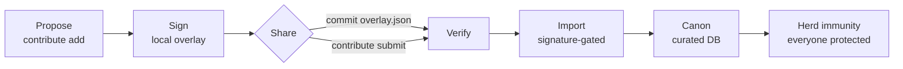
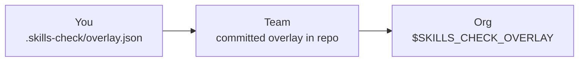

# Contributor guide

How to extend SecureVibe — block a newly-discovered bad package, share that block with your team or peers, and contribute a new skill or curated data entry.

This is the **LEARN** stage of the lifecycle (PREVENT → DETECT → ENFORCE → **LEARN**). When you hit a pattern the tool didn't catch, you turn it into a signed rule that protects you first, then the people you share it with. See the [Developer guide](developer.md) for project layout and the [Security guide](security.md) for the trust model.

## The LEARN loop

The core idea: you discover a novel bad package locally, you contribute it, and that contribution flows outward — from your machine, to your team, eventually toward everyone. Each hop is gated by an **Ed25519 signature**, because a block list is itself a trust boundary: a poisoned entry could be used to flag a legitimate dependency.



| Hop | Mechanism | Scope |
| --- | --- | --- |
| Propose | `contribute add` writes a rule to a local overlay | You |
| Sign | `contribute keygen` + `--key` stamps an Ed25519 signature | You |
| Share (team) | commit `.skills-check/overlay.json` — git is the fan-out | Your team |
| Share (peer) | `contribute submit` → `verify` → `import` | Another maintainer |
| Canon | curated DB review (future infra — see boundary note below) | Everyone |

!!! note "Why signing matters"
    Importing an unsigned candidate is an explicit opt-in (`--allow-unsigned`). Everywhere else, provenance is enforced. A block list with no signatures is a supply-chain risk in its own right — anyone could ship a candidate that quietly flags a package you depend on.

## Block a package locally (30 seconds)

Say you found a malicious npm package and want the gate to start blocking it **now**, before any upstream catches up.

1. **Generate a signing key (one time).** This creates an Ed25519 keypair used to sign your contributions for provenance.

    ```bash
    skills-check contribute keygen --out ~/.skills-check/contrib.key
    ```

2. **Add the package to your local overlay.** `-p` is the package name, `-e` is the ecosystem. The default severity is `high`, so the gate blocks it.

    ```bash
    skills-check contribute add \
      -p evil-pkg \
      -e npm \
      --versions "1.0.0,1.0.1" \
      --reason "post-install script exfiltrates env vars" \
      --references "https://example.com/advisory" \
      --key ~/.skills-check/contrib.key
    ```

3. **Inspect the signed overlay.** It is a plain JSON file at `.skills-check/overlay.json`:

    ```json
    {
      "schema_version": "1",
      "malicious_packages": [
        {
          "name": "evil-pkg",
          "ecosystem": "npm",
          "versions_affected": ["1.0.0", "1.0.1"],
          "severity": "high",
          "type": "locally_flagged",
          "description": "post-install script exfiltrates env vars",
          "references": ["https://example.com/advisory"],
          "contributor": "you",
          "signature": "…",
          "public_key_id": "…"
        }
      ]
    }
    ```

4. **Confirm the gate now blocks it.** Re-run the dependency scanner or the gate against a project that lists the package; it exits non-zero:

    ```bash
    skills-check scan-dependencies .
    skills-check gate . --min-severity high
    ```

!!! tip "Nothing leaves your machine"
    The overlay is read locally from `.skills-check/overlay.json` by every scan and gate run. It does **not** leave your machine until you choose to share it — by committing it, or by submitting a candidate.

You can review or prune your overlay at any time:

```bash
skills-check contribute list
skills-check contribute remove -p evil-pkg -e npm
```

## Share with your team

Sharing with a team requires no special infrastructure — **git is the fan-out**. Commit the overlay file and every teammate who pulls it inherits the block:

```bash
git add .skills-check/overlay.json
git commit -m "block evil-pkg (post-install exfiltration)"
```

The overlay scope chain layers three sources, narrowest to widest:



| Scope | Where the overlay lives |
| --- | --- |
| You | `.skills-check/overlay.json` in your working tree |
| Team | the same file, committed to the repo (git distributes it) |
| Org | a shared file pointed to by `$SKILLS_CHECK_OVERLAY` (a path-list env var), kept outside any single repo |

Set the org-wide overlay in your shell or CI environment:

```bash
export SKILLS_CHECK_OVERLAY=/etc/skills-check/org-overlay.json
```

## Share peer-to-peer

To hand a block to a maintainer who is **not** in your repo, export a portable candidate file. Sign it so the recipient can verify where it came from:

```bash
skills-check contribute submit --key ~/.skills-check/contrib.key --out evil-pkg.candidate.json
```

The other maintainer verifies the signature, then imports it into their own overlay:

```bash
# 1. Check provenance before trusting anything
skills-check contribute verify evil-pkg.candidate.json

# 2. Merge into the local overlay (signature-gated by default)
skills-check contribute import evil-pkg.candidate.json
```

!!! warning "Import is signature-gated"
    `contribute import` refuses an unsigned candidate. To import one anyway you must pass `--allow-unsigned` explicitly — an acknowledgement that you are accepting a block with no provenance. Treat a poisoned block list as a real threat: a hostile candidate can be crafted to flag a package you rely on.

## Contribute a new skill or DB entry

### A new skill

Skills are structured knowledge that AI assistants read at generation time. Each one lives at `skills/<id>/SKILL.md`. To add or change a skill:

1. Create or edit `skills/<your-skill-id>/SKILL.md`.
2. Validate the whole library and test your specific skill:

    ```bash
    skills-check validate
    skills-check test <your-skill-id>
    ```

3. Regenerate any derived artifacts if you changed structured data:

    ```bash
    skills-check regenerate
    ```

4. Open a PR.

### A malicious-package data entry

The curated database is the data moat — exact-match lookups give **zero false positives** precisely because every entry is real and web-cited. That property is only as good as the discipline behind it.

!!! danger "Data discipline — read this before adding an entry"
    **NEVER fabricate a CVE, a version, or an incident.** A bogus entry is worse than a missing one: it produces a false positive that erodes trust in the whole list, and (if shared) can be weaponized against a legitimate package. Every entry MUST carry:

    - a **public reference** (advisory, CVE record, registry takedown, or write-up), and
    - the **exact affected versions** — never "all versions" as a guess.

    If you cannot cite it, do not add it.

Run `skills-check validate` before opening any PR, and `skills-check test <skill-id>` for skill changes.

## The open-core boundary (honest note)

Today, sharing is **peer-to-peer + git** only, exactly as documented above. The further hops in the LEARN loop — a central candidate → canon **signing pipeline** that promotes verified community submissions into the canonical curated DB — are **future paid infrastructure that is not built yet**.

That boundary is deliberate. Paid covers only **scale and trust infrastructure**: the central signing pipeline, a private registry, fleet-wide policy, and SLAs. A security fix or a block list entry is **never paywalled** — the entire prevention path (skills, scanners, gate, local + team + org overlays) is open and free. See the [Evaluator guide](evaluator.md) for the full open-core rationale.
