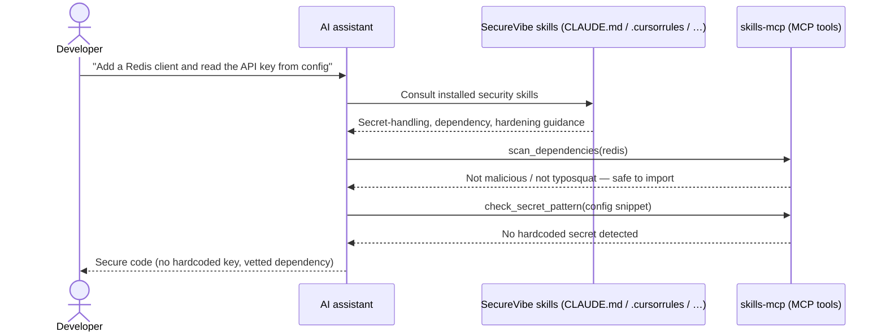

# Developer guide

Get your AI coding assistant to write secure code at generation time — and catch what slips through before it ever reaches a commit.

## How it helps you

SecureVibe works **left of the cursor**. Instead of waiting for a scanner to flag a vulnerability after your AI assistant has already written it, SecureVibe feeds the assistant signed security **skills** — structured `SKILL.md` knowledge that shapes what it writes in the first place. The deterministic scanners are the backstop, and the [`gate`](#guard-your-commits-locally) is the last line of defense.

The lifecycle is **PREVENT → DETECT → ENFORCE → LEARN**:

- **PREVENT** — 29 skills are installed into your assistant's config and consulted as it writes.
- **DETECT** — 4 narrow, deterministic scanners (secrets, dependencies, Dockerfile, GitHub Actions) check the result.
- **ENFORCE** — a `gate` blocks insecure diffs locally and in CI.
- **LEARN** — when you find a bad package the DB doesn't know about, you teach it in 30 seconds.

Here is the gen-time prevention flow when you ask your assistant to write code:



The skills make the assistant *want* to write secure code; the MCP tools let it *check its work* while it writes.

!!! note "Keyless and offline"
    The whole flow runs locally. No API key, no telemetry, no cloud dependency. Releases are Ed25519-signed.

## Set up in your IDE

`skills-check init` writes the right config file for your assistant. Pick the tab for your tool:

=== "Claude Code"

    ```bash
    skills-check init --tool claude
    ```

    Writes **`CLAUDE.md`** — the project instructions Claude Code reads on every session.

=== "Cursor"

    ```bash
    skills-check init --tool cursor
    ```

    Writes **`.cursorrules`** — the rules Cursor applies to its completions and chat.

=== "GitHub Copilot"

    ```bash
    skills-check init --tool copilot
    ```

    Writes **`.github/copilot-instructions.md`** — repo-wide instructions for Copilot.

=== "Codex"

    ```bash
    skills-check init --tool codex
    ```

    Writes **`AGENTS.md`** — the agent instructions file Codex reads.

=== "Windsurf"

    ```bash
    skills-check init --tool windsurf
    ```

    Writes **`.windsurfrules`**.

=== "Cline"

    ```bash
    skills-check init --tool cline
    ```

    Writes **`.clinerules`**.

=== "Devin"

    ```bash
    skills-check init --tool devin
    ```

    Writes **`devin.md`**.

SecureVibe ships skills for **8 assistants** in total — Claude Code, Cursor, GitHub Copilot, Codex, Windsurf, Cline/OpenCode, Antigravity, and Devin.

Steps:

1. Install the CLI (see the tabs below) if you haven't already.
2. Run `skills-check init --tool <your-tool>` at the root of your repo.
3. Commit the generated config file so your whole team gets the same guidance.
4. Restart your assistant (or start a new session) so it picks up the new instructions.

=== "install.sh"

    ```bash
    curl -fsSL https://raw.githubusercontent.com/nguyencongnamit/skills-library/main/install.sh | sh
    ```

=== "Homebrew"

    ```bash
    brew install nguyencongnamit/tap/skills-check
    ```

=== "Go"

    ```bash
    go install github.com/namncqualgo/skills-library/cmd/skills-check@latest
    ```

=== "npx"

    ```bash
    npx @namncqualgo/secure-code-skill init
    ```

## Add the MCP server

The MCP server (`skills-mcp`) exposes SecureVibe's scanners as tools your assistant can call directly while it works, over stdio.

Add it to Claude Code:

```bash
claude mcp add securevibe -- npx -y @namncqualgo/secure-code-mcp
```

For any other MCP-capable client, point it at the `skills-mcp` binary as a **stdio** server (it speaks MCP over stdin/stdout — no network).

The server exposes **16 MCP tools**. The ones your assistant reaches for most often:

| Tool | What it does | When the assistant calls it |
| --- | --- | --- |
| `scan_dependencies` | Checks a package against the curated malicious/typosquat/CVE/OSV data | **Before importing a dependency** |
| `scan_secrets` | Scans a file or snippet for secrets | Before writing or committing config/credentials |
| `check_secret_pattern` | Tests whether a specific string matches a secret pattern | While drafting code that handles keys/tokens |
| `lookup_vulnerability` | Looks up a known CVE / advisory by identifier | When evaluating a library or version |
| `scan_dockerfile` | Lints a Dockerfile for insecure patterns | While authoring or editing a `Dockerfile` |
| `scan_github_actions` | Checks workflow files for risky patterns | While editing `.github/workflows/*` |
| `map_compliance_control` | Maps findings to a compliance control | When you ask about SOC2/HIPAA/PCI-DSS coverage |
| `gate` | Runs the enforcing gate over a path | Before finalizing a change |

!!! tip "Exact-match dependency lookups are zero-false-positive"
    `scan_dependencies` is backed by a curated, web-cited malicious-package DB — **3,623 entries across 10 ecosystems** (npm, nuget, pypi, rubygems, plus curated composer/crates/docker/maven/go/github-actions). Exact-match lookups don't false-positive, so the assistant can trust a "this package is malicious" answer.

## Guard your commits locally

The scanners are the backstop; the **gate** is the line your insecure code can't cross. Wire it into a pre-commit hook so nothing risky leaves your machine:

```bash
skills-check gate . --min-severity high
```

The gate auto-picks the right scanner per file, exits non-zero on anything at or above the severity floor, and (with `--sarif results.sarif`) emits SARIF for GitHub Code Scanning.

A minimal `.git/hooks/pre-commit`:

```bash
#!/bin/sh
skills-check gate . --min-severity high || {
    echo "SecureVibe gate failed — fix the findings above or lower --min-severity."
    exit 1
}
```

Make it executable with `chmod +x .git/hooks/pre-commit`. The same command runs unchanged in CI — see the [DevOps guide](devops.md) for the full GitHub Actions + SARIF setup.

## Found a bad package the DB doesn't know? — the 30-second LEARN loop

The curated DB is large but not omniscient. When *you* discover a malicious or typosquatted package it doesn't yet flag, teach it:

```bash
skills-check contribute add -p <pkg> -e npm
```

This writes a **signed** local overlay at `.skills-check/overlay.json`. On the very next run, the gate and scanners block that package.

To share what you learned:

- **Your machine** — the overlay lives at `.skills-check/overlay.json`.
- **Your team** — commit the overlay file; git is the fan-out.
- **Your org** — point `$SKILLS_CHECK_OVERLAY` at a path-list of shared overlays.

For peer-to-peer sharing across trust boundaries — `contribute submit --sign`, maintainer `contribute verify` / `contribute import`, and key management with `contribute keygen` — see the [Contributor guide](contributor.md).

!!! warning "Honest limits"
    SecureVibe's detection is **narrow by design** — 4 deterministic scanners, not a general SAST and not a replacement for one. The keyless tool catches **known patterns** (curated malicious packages, secret signatures, risky Dockerfile/Actions constructs) and **misses novel or semantic bugs**. That's the accepted trade-off: fast, offline, zero-false-positive exact matches at generation time, with a gate as the backstop — not a promise to find every vulnerability.
