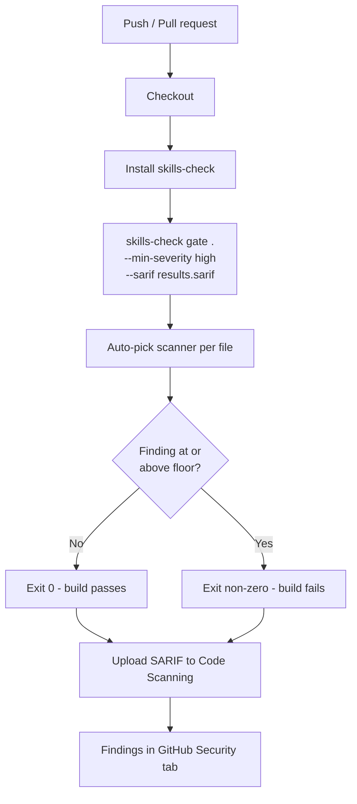
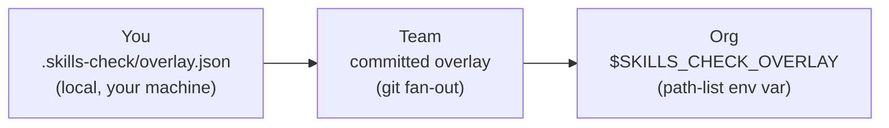
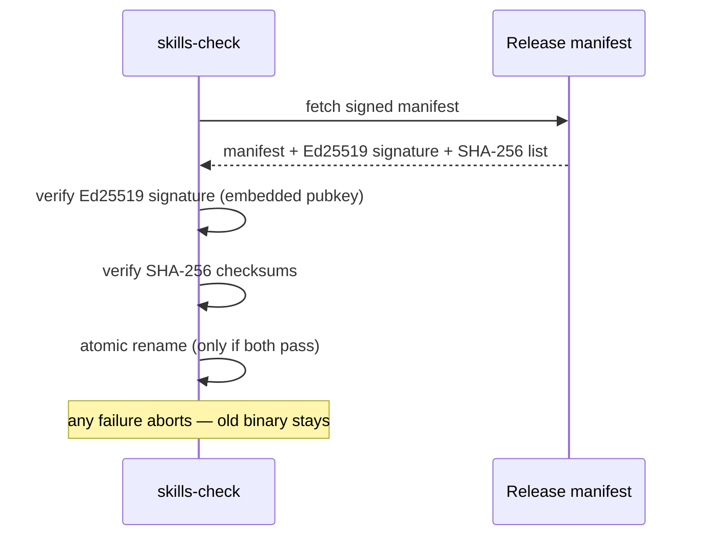

# DevOps / Platform guide

How to roll SecureVibe's `skills-check` gate across CI and fan it out to a whole team or org using git and signed overlays.

This guide is for the platform engineer who owns CI and developer tooling. It covers wiring the gate into pipelines, pre-commit hooks, committing the assistant config and contribution overlay so the team inherits blocks, layering an org-wide policy, running fully air-gapped, and keeping the binary fresh and trusted.

!!! note "What the gate is — and isn't"
    The gate is a **fast, high-precision check** built on 4 deterministic scanners
    (secrets, dependencies, Dockerfiles, GitHub Actions). It is **narrow by design** —
    it is not a SAST replacement and does not try to find every vulnerability. Treat it
    as a cheap, exact-match guardrail you can run on every commit, not a comprehensive
    audit. See the [honest note](#honest-note-narrow-by-design) below.

## The gate in CI

The gate auto-picks the right scanner per file, exits non-zero when it finds anything at or above the severity floor, and emits SARIF for GitHub Code Scanning:

```bash
skills-check gate <path> --min-severity high --sarif results.sarif
```

| Flag | Meaning |
| --- | --- |
| `<path>` | File or directory to gate (the scanner is chosen per file). |
| `--min-severity high` | Severity floor — findings at or above this fail the build. |
| `--sarif results.sarif` | Write SARIF 2.1.0 for GitHub Code Scanning / any SARIF viewer. |

### GitHub Actions workflow

This workflow installs `skills-check`, runs the gate, and uploads the SARIF to GitHub Code Scanning. The `upload-sarif` step runs even if the gate fails, so findings always surface in the Security tab.

```yaml
name: SecureVibe gate

on:
  push:
    branches: [main]
  pull_request:

permissions:
  contents: read
  security-events: write   # required to upload SARIF

jobs:
  securevibe:
    runs-on: ubuntu-latest
    steps:
      - uses: actions/checkout@v4

      - name: Install skills-check
        run: curl -fsSL https://raw.githubusercontent.com/nguyencongnamit/skills-library/main/install.sh | sh

      - name: Run the gate
        id: gate
        run: skills-check gate . --min-severity high --sarif results.sarif

      - name: Upload SARIF to Code Scanning
        if: always()   # surface findings even when the gate fails the build
        uses: github/codeql-action/upload-sarif@v3
        with:
          sarif_file: results.sarif
```

!!! tip "Tune the floor per pipeline"
    Use `--min-severity high` on protected branches and `critical` on hotfix lanes if
    you want the lowest possible friction. Lower the floor in nightly jobs to surface
    medium findings without blocking developers.

### CI gate flow



## Pre-commit hook

Catch issues before they ever reach CI. Run the gate on the working tree from a hook:

=== "Plain git hook"

    ```bash
    # .git/hooks/pre-commit  (chmod +x)
    #!/bin/sh
    skills-check gate . --min-severity high || {
      echo "SecureVibe gate failed — fix findings or lower the floor."
      exit 1
    }
    ```

=== "pre-commit framework"

    ```yaml
    # .pre-commit-config.yaml
    repos:
      - repo: local
        hooks:
          - id: securevibe-gate
            name: SecureVibe gate
            entry: skills-check gate . --min-severity high
            language: system
            pass_filenames: false
    ```

## Team rollout

Two files, committed to the repo, make the whole team inherit the same behaviour — **git is the fan-out**.

1. **Commit the assistant config.** Generate it once for the team's primary assistant and commit it so every clone writes secure code at generation time:

    ```bash
    skills-check init --tool claude     # writes CLAUDE.md
    git add CLAUDE.md
    git commit -m "Add SecureVibe skills config"
    ```

    `init --tool <claude|cursor|copilot|codex|windsurf|cline|devin>` writes the matching
    config file (`CLAUDE.md`, `.cursorrules`, `.github/copilot-instructions.md`,
    `AGENTS.md`, `.windsurfrules`, `.clinerules`, `devin.md`). Commit whichever your
    team uses — commit several if your team is multi-tool.

2. **Commit the contribution overlay.** When anyone blocks a package via the LEARN loop, it lands in a signed local overlay. Commit that file and the whole team inherits the block on their next gate run:

    ```bash
    skills-check contribute add -p evil-pkg -e npm   # writes .skills-check/overlay.json
    git add .skills-check/overlay.json
    git commit -m "Block evil-pkg via SecureVibe overlay"
    ```

!!! example "Why this works"
    The overlay is a signed JSON file under `.skills-check/`. Because it lives in the
    repo, every `git pull` distributes it; the next `skills-check gate` reads it and
    blocks the package. No registry, no server — the git remote is the distribution
    channel.

## Org-wide policy

For policy that must apply across many repos — outside any single repo — point `$SKILLS_CHECK_OVERLAY` at one or more overlay files that live in an org-managed location (a checked-out policy repo, a mounted path, a config-managed directory):

```bash
export SKILLS_CHECK_OVERLAY=/etc/securevibe/org-overlay.json
# path-list: multiple overlays, OS path separator
export SKILLS_CHECK_OVERLAY=/etc/securevibe/org.json:/etc/securevibe/finance.json
```

### Scope chain

Overlays compose along a three-level scope chain — each level adds blocks the level below inherits:



| Scope | Source | Distribution |
| --- | --- | --- |
| **You** | `.skills-check/overlay.json` (uncommitted) | Local to your machine. |
| **Team** | the same file, **committed** | git pull. |
| **Org** | `$SKILLS_CHECK_OVERLAY` path-list | Set centrally on CI runners / dev images. |

!!! tip "Set it on the runner image"
    The cleanest place to set `$SKILLS_CHECK_OVERLAY` org-wide is the base CI image or
    the developer dev-container — every job and every engineer then inherits the org
    policy without per-repo wiring.

## Air-gapped / offline

`skills-check` is **fully offline**: bundled data, no telemetry, no cloud dependency, no API key. It runs in an air-gapped network with no changes. The only thing that needs network is bringing in *new* data, and that can be delivered as a file.

1. **Install once** on a connected host (or use the Go install for a self-contained binary) and copy the binary into the air-gapped environment, or run the bundled installer there from a mirror.
2. **Update from a local source** instead of the public CDN — point `update` at a tarball or an internal CDN mirror:

    ```bash
    skills-check update --source /mnt/airgap/securevibe-data.tar.gz
    # or an internal mirror
    skills-check update --source https://mirror.internal/securevibe/
    ```

!!! warning "No outbound calls required"
    Because the curated malicious-package DB and patterns ship in the binary/data
    bundle, exact-match lookups work with zero network access. Keep the air-gapped data
    bundle on a schedule you control — see freshness below.

## Keeping it fresh & trusted

Two commands keep the binary current and verifiable:

```bash
# Upgrade the binary itself — signature- and checksum-verified
skills-check self-update

# Fail a job if local data is stale (good as a CI canary)
skills-check status --fail-if-stale
```

`self-update` fetches the signed release manifest, then verifies a **detached Ed25519 signature** against the embedded public key **and** the **SHA-256 checksums** per file, and only then atomically replaces the binary (crash-safe rename). The private signing key is held offline.



!!! tip "Wire status into CI"
    Add `skills-check status --fail-if-stale` as a scheduled job so a pipeline goes red
    when its data falls behind, prompting a refresh via `self-update` or an air-gapped
    `update --source`.

## Honest note: narrow by design

SecureVibe's detection is **4 deterministic scanners** (secrets, dependencies, Dockerfiles, GitHub Actions) — narrow on purpose. Position the gate accordingly:

- It is a **fast, high-precision gate**, not a SAST replacement and not a comprehensive vulnerability finder.
- It catches **known patterns** — exact-match malicious-package lookups, known secret shapes, misconfigurations. It **misses novel and semantic bugs**; that is the accepted trade-off for speed and a near-zero false-positive rate.
- On the curated malicious-package DB, exact-match lookups produce **zero false positives** — that precision is the reason it's safe to block builds on.
- Keep it as the cheap first gate in a defence-in-depth pipeline. Run it on every commit; pair it with deeper tools where you need semantic coverage.

See the [Developer guide](developer.md) for scanner internals and the contribution loop, or the [Quick start](../quickstart.md) to get going.
