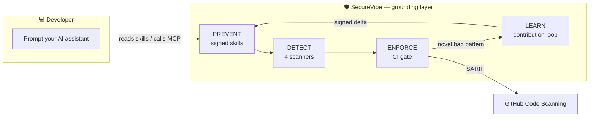

# Guides — choose your path

SecureVibe meets you where you work. Pick the role that fits and follow a concrete,
step-by-step path — or skim the [concepts](../concepts/why.md) first to understand
*why* it's built this way.

!!! tip "New here?"
    Start with the **[Evaluator guide](evaluator.md)** — it explains SecureVibe in 60
    seconds and proves it works on your machine in about five minutes.

## By role

| You are a… | Your goal | Start here |
|---|---|---|
| 🧭 **Evaluator / newcomer** | Understand it and prove it works fast | [Evaluator guide](evaluator.md) |
| 💻 **Developer** | Secure code written *as you prompt*, in your IDE | [Developer guide](developer.md) |
| ⚙️ **DevOps / Platform** | A CI gate + team/org rollout, offline & signed | [DevOps guide](devops.md) |
| 🛡️ **Security / AppSec** | Threat model, honest scope, trust & compliance | [Security guide](security.md) |
| 🔧 **Contributor** | Extend the block list; share findings; add skills | [Contributor guide](contributor.md) |

## The whole picture in one diagram

## Understand the design

- **[Why SecureVibe](../concepts/why.md)** — the problem, the gen-time insight, and the
  flywheel that is the actual moat (no hype — honest status included).
- **[What makes it different](../concepts/features.md)** — the highlight reel: skills,
  the zero-FP curated DB, the LEARN loop, signed self-update, MCP-native.
- **[Architecture](../concepts/architecture.md)** — the grounding/reasoning split, the
  four surfaces, the lifecycle, and an end-to-end MCP request.

!!! info "Honest by default"
    SecureVibe's detection is deliberately **narrow** — four high-precision scanners,
    not a general SAST. It catches the patterns AI assistants actually emit; it does
    not find every novel or semantic bug, and it has **no production users yet**. Every
    number in these docs is reproducible from the repo. See the
    [Security guide](security.md) for the full scope and limits.
