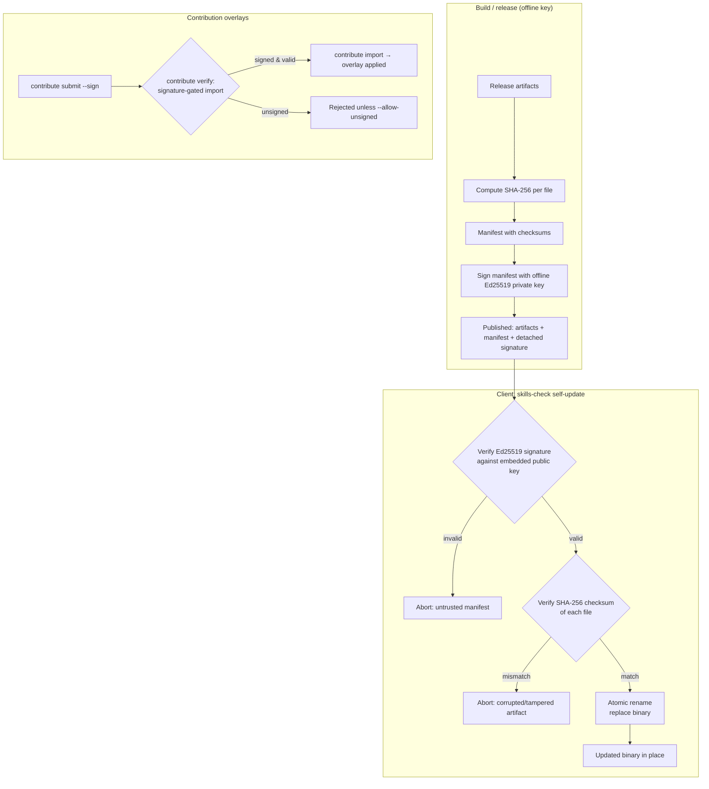

# Security / AppSec guide

A trust- and scope-focused guide to what SecureVibe defends, what it deliberately does **not**, and how to verify every claim yourself.

This page is written for a security or AppSec engineer evaluating SecureVibe. It states the threat model plainly, draws an honest boundary around detection, documents the supply-chain integrity guarantees, and shows how to vet the project offline. See also the [Developer guide](developer.md) and the [Quick start](../quickstart.md).

---

## Threat model — what SecureVibe defends

SecureVibe is **prevention-first security for AI-written code** ("left of the cursor"). The threat it targets is specific:

> AI coding assistants reliably emit the *same* insecure patterns at generation time — and they do so faster than human review can keep up.

The defended classes are the recurring, mechanical mistakes that show up in generated code and configuration:

- **Hardcoded secrets** — API keys, tokens, and credentials pasted or invented directly into source.
- **Unpinned CI** — GitHub Actions referenced by mutable tags/branches instead of pinned commit SHAs.
- **Insecure containers** — Dockerfiles that run as root, pull `:latest`, or otherwise drift from least-privilege defaults.
- **Malicious / typosquatted dependencies** — packages that impersonate popular libraries or are known-bad, pulled in because the model "remembered" a plausible-looking name.

SecureVibe addresses these in two lanes that reinforce each other:

1. **Prevent** — signed security **skills** are fed to the assistant so it writes secure code at generation time.
2. **Detect → Enforce** — four deterministic scanners back the skills, and a `gate` blocks insecure diffs in CI.

!!! note "The skills are the product; the scanners are the backstop"
    The strategic bet is the generation-time lane. The scanners exist to catch what slips through and to give CI an objective, exit-code-driven gate.

### What it does NOT do

Being explicit here is part of the trust contract:

- **Narrow, deterministic detection (4 scanners only).** Detection is **narrow by design**, not comprehensive. It is not a general-purpose SAST and is not a replacement for one.
- **Known patterns, not novel/semantic bugs.** The scanners match known shapes (secret formats, known-bad packages, Dockerfile/Actions anti-patterns). They will **miss novel or semantically subtle vulnerabilities** — business-logic flaws, auth bypasses, injection that depends on data flow. That trade-off is accepted and deliberate.
- **No runtime, no DAST, no fuzzing.** SecureVibe operates on source, dependencies, and configuration statically. It does not observe a running application.
- **No exhaustive vulnerability discovery.** It never claims to "find every vulnerability." The dependency check is strongest on **exact-match** lookups against a curated database, where false positives are effectively zero.

!!! warning "Read this boundary literally"
    If your evaluation needs deep semantic analysis, data-flow taint tracking, or runtime testing, SecureVibe does not provide it and is not intended to. Pair it with a dedicated SAST/DAST stack. SecureVibe's value is *upstream* of those tools — at the moment code is generated.

---

## Detection scope (honest)

Four scanners are **enforced** by the tooling. The 29 skills cover a broader set of security domains as *prevention guidance* at generation time, but only the four below are backed by a deterministic scanner and the CI gate.

| Scanner | Command | What it catches |
|---|---|---|
| **Secrets** | `skills-check scan-secrets <path>` | Hardcoded API keys, tokens, and credentials via 74 secret/DLP detection patterns. |
| **Dependencies** | `skills-check scan-dependencies <path>` | Malicious / typosquatted packages, plus CVE/OSV matches, via exact-match lookups against the curated DB (2,022 entries across 9 ecosystems) and 58 CVE code-patterns. |
| **Dockerfile** | `skills-check scan-dockerfile <path>` | Container anti-patterns — root user, unpinned/`:latest` base images, and related least-privilege drift. |
| **GitHub Actions** | `skills-check scan-github-actions <path>` | Unpinned actions, mutable refs, and insecure CI workflow configuration. |

!!! note "Skills ≠ scanners"
    Prevention skills span more domains than the four enforced scanners. Treat the table above as the **enforced** detection surface; the skills are advisory at generation time.

### Measured results

State these exactly, with their caveats — they are prevention ground-truth, not universal detection claims.

- **Secret scanner:** 100% precision / 100% recall versus gitleaks at 92.4% / 65.9% (76.9 F1) — **on SecureVibe's own tuned corpus ("on the shapes we tested")**. The honest signal here is gitleaks' *recall gap* on these shapes, not a universal accuracy claim.
- **Structured scanners (dependencies / Dockerfile / GitHub Actions):** 100% precision / 100% recall on the **committed eval corpus** — this is **prevention ground-truth, not a claim of universal detection**.

!!! warning "These numbers are corpus-bounded"
    "On the shapes we tested" and "on the committed eval corpus" are load-bearing qualifiers. They do not generalize to arbitrary real-world inputs, and SecureVibe does not present them as if they do.

---

## Trust & supply-chain integrity

SecureVibe is built so that you can trust the *binary* and the *data* it carries without trusting a vendor service.

- **Ed25519-signed releases.** Every release is signed with an Ed25519 key whose private half is held offline.
- **Per-file SHA-256 manifest.** The release manifest carries a SHA-256 checksum for each file.
- **Verified self-update.** `skills-check self-update` fetches the signed manifest, then verifies in order: **(1) the detached Ed25519 signature** against the embedded public key, **(2) the SHA-256 checksums**, and only then **(3) atomically replaces** the binary via rename (crash-safe — a failure leaves the existing binary intact).
- **Offline, no telemetry, MIT, auditable.** Fully offline operation, no cloud dependency, no API key required, no telemetry. MIT-licensed and readable end-to-end.
- **Signed contribution overlays.** Community contributions to the malicious-package data are signed; **import is signature-gated** (`--allow-unsigned` is an explicit opt-in, not the default).

### Signing & verification chain



!!! tip "The data has a trust boundary too"
    The integrity story is not only about the binary. The curated malicious-package DB and any imported overlays travel through the same signature discipline, so a poisoned data contribution cannot enter silently.

---

## Compliance evidence

SecureVibe can emit a **control-coverage report** to support compliance workstreams:

```bash
skills-check evidence --framework SOC2 --format markdown
skills-check evidence --framework HIPAA --format markdown
skills-check evidence --framework PCI-DSS --format markdown
```

- **Frameworks:** SOC2, HIPAA, PCI-DSS.
- **Mappings live in source:** `compliance/*.yaml` — auditable and version-controlled, so the mapping logic is inspectable rather than opaque.
- **Enterprise profiles:** `financial-services`, `government`, `healthcare`.

!!! warning "This is a coverage map, not an audit"
    The evidence output is a **developer-facing coverage map** that shows which controls SecureVibe's checks relate to. It is **not a substitute for a real audit** by a qualified assessor, and it does not assert that an organization is compliant. Use it as input to an audit, not as its conclusion.

---

## How to vet it yourself

SecureVibe is designed to be evaluated without trusting anyone — including its authors.

1. **Read the source.** It is MIT-licensed and offline. Clone the repo and read the four scanners, the self-update verification path, and the `compliance/*.yaml` mappings directly.

   ```bash
   git clone https://github.com/nguyencongnamit/skills-library
   cd skills-library
   ```

2. **Run it offline.** No API key, no telemetry, no cloud call is required. Run the scanners on your own fixtures and disconnect the network to confirm there is no egress.

   ```bash
   skills-check scan-secrets .
   skills-check scan-dependencies .
   skills-check scan-dockerfile .
   skills-check scan-github-actions .
   ```

3. **Reproduce the eval.** The eval corpus is committed. Re-run the scanners against it to reproduce the stated precision/recall — and confirm for yourself that the numbers are corpus-bounded, exactly as documented above.

4. **Verify the release chain.** Inspect the signed manifest and the embedded public key, and confirm `self-update` verifies signature → checksum → atomic rename before trusting an upgrade.

   ```bash
   skills-check self-update
   ```

5. **Inspect the data moat.** The curated malicious-package DB and every overlay are web-cited and signature-gated. Review the entries and the import path before relying on them.

!!! note "No production users yet"
    SecureVibe has **no production users yet**. Evaluate it on its source, its reproducible eval, and its verification chain — not on adoption signals, which do not exist.

---

For deeper operational detail, continue to the [Developer guide](developer.md), the [Contribution loop](../contribute.md), or the [Quick start](../quickstart.md).
