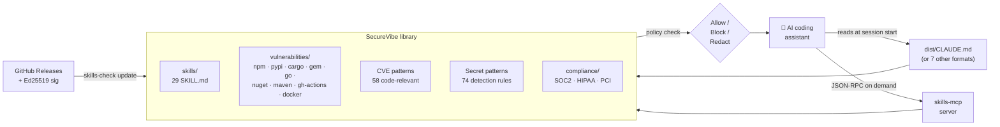

---
hide:
  - navigation
  - toc
---

<div class="ss-hero" markdown>

# SecureVibe

Prevention-first security for AI-written code. Signed security skills shape what your assistant writes, deterministic scanners back it up, and a CI gate blocks what slips through — across Claude Code, Cursor, Copilot, Codex, Windsurf, Cline, Antigravity, and Devin.

<div class="ss-hero-shields">
  
  
  
  
  
  
  
  
</div>

<div class="ss-hero-demo">
  
</div>

```
npx -p @namncqualgo/secure-code-mcp secure-code-check gate Dockerfile --severity-floor high
```

<div class="ss-hero-badges">
  <a href="quickstart/">🚀 Quick Start</a>
  <a href="https://github.com/namncqualgo/skills-library">💻 GitHub</a>
  <a href="https://github.com/namncqualgo/skills-library/blob/main/ARCHITECTURE.md">🏗️ Architecture</a>
  <a href="https://github.com/namncqualgo/skills-library/blob/main/SIGNING.md">✍️ Signing</a>
  <a href="https://github.com/namncqualgo/skills-library/tree/main/cmd/skills-mcp">🛰️ MCP Server</a>
</div>

<div class="ss-stats">
  <div class="ss-stat"><span class="ss-stat-value">29</span><span class="ss-stat-label">Skills</span></div>
  <div class="ss-stat"><span class="ss-stat-value">58</span><span class="ss-stat-label">CVE Patterns</span></div>
  <div class="ss-stat"><span class="ss-stat-value">9</span><span class="ss-stat-label">Supply-Chain Ecosystems</span></div>
  <div class="ss-stat"><span class="ss-stat-value">74</span><span class="ss-stat-label">Secret Patterns</span></div>
  <div class="ss-stat"><span class="ss-stat-value">8</span><span class="ss-stat-label">AI Client Integrations</span></div>
</div>

</div>

<div class="ss-section" markdown>

## The problem

Your developers use Claude Code, Cursor, Copilot, and a dozen other AI coding assistants every day. They accept generated code that imports compromised packages, hardcodes API keys, opens SSRF holes, and ships unsafe deserialization patterns into production. Three structural gaps drive this:

**1. AI assistants ship without current security context.** Training data is months or years stale. A package compromised yesterday is happily imported by the model today. CWE / OWASP rules live nowhere the assistant looks at generation time.

**2. Supply-chain intel changes daily; static rules go stale.** Typosquats, malicious-package disclosures, and CVE-to-code patterns evolve every week. A rule file checked in last quarter is already wrong. You need delta-updatable, cryptographically signed intel — not yet another quarterly export.

**3. Each AI vendor ships its own secret-handling rules, or nothing at all.** Claude has CLAUDE.md, Cursor has .cursorrules, Copilot has copilot-instructions.md, Codex has AGENTS.md — eight surfaces, eight formats, eight blind spots. There's no shared rule corpus and no on-demand lookup API that any of them can call.

</div>

<div class="ss-section" markdown>

## Embed in 3 commands

Everything ships on npm — no checkout, no Go toolchain. The package bundles the
platform binary and the rule data; pick a surface.

```bash
# Drop the skills into a project (writes IDE config, e.g. CLAUDE.md)
npx @namncqualgo/secure-code-skill init --tool claude
```

```bash
# Or wire the MCP server so any MCP-speaking client can call its tools on demand
claude mcp add secure-code -- npx -y @namncqualgo/secure-code-mcp
```

```bash
# Or gate files from the terminal / CI / pre-commit (deterministic, exit code)
npx -p @namncqualgo/secure-code-mcp secure-code-check gate Dockerfile package-lock.json --severity-floor high
```

`gate` picks the right scanner per file (Dockerfile / lockfile / workflow → specialised
scanner; anything else → secret scan) and exits non-zero when a finding meets the floor.
The data is bundled, so it runs fully offline.

</div>

<div class="ss-section" markdown>

## How it works



Every surface is optional. Drop a static `CLAUDE.md` for zero-config baseline coverage. Add the MCP server to get on-demand vulnerability lookups, dependency scans, and Dockerfile hardening checks without spending tokens until they're actually needed.

</div>

<div class="ss-section" markdown>

## Components

<div class="ss-cards">
<a class="ss-card" data-pkg="skills" href="https://github.com/namncqualgo/skills-library/tree/main/skills">
<span class="ss-card-icon">🧠</span>
<span class="ss-card-body"><span class="ss-card-title">Skill Catalogue</span>
<span class="ss-card-desc">29 structured security skills, machine-readable, ranked by severity. Three token tiers (minimal / compact / full) per skill.</span></span>
</a>
<a class="ss-card" data-pkg="cve" href="https://github.com/namncqualgo/skills-library/tree/main/vulnerabilities/cve">
<span class="ss-card-icon">🛡️</span>
<span class="ss-card-body"><span class="ss-card-title">CVE Patterns</span>
<span class="ss-card-desc">58 code-relevant CVE detection patterns — what the diff looks like, not just which version is bad.</span></span>
</a>
<a class="ss-card" data-pkg="supply" href="threat-intel/">
<span class="ss-card-icon">📦</span>
<span class="ss-card-body"><span class="ss-card-title">Supply-Chain Intel</span>
<span class="ss-card-desc">2,022 web-cited malicious-package entries across 10 ecosystems + typosquats. Browse the curated canon →</span></span>
</a>
<a class="ss-card" data-pkg="secrets" href="https://github.com/namncqualgo/skills-library/tree/main/skills/secret-detection">
<span class="ss-card-icon">🔐</span>
<span class="ss-card-body"><span class="ss-card-title">Secret Patterns</span>
<span class="ss-card-desc">74 secret-detection patterns optimised for AI-assistant context, with entropy and hotword-proximity scoring.</span></span>
</a>
<a class="ss-card" data-pkg="signing" href="https://github.com/namncqualgo/skills-library/blob/main/SIGNING.md">
<span class="ss-card-icon">✍️</span>
<span class="ss-card-body"><span class="ss-card-title">Ed25519 Signing</span>
<span class="ss-card-desc">Cryptographically signed manifest updates. YubiKey-backed signing, verify-before-replace, atomic atomic writes.</span></span>
</a>
<a class="ss-card" data-pkg="cli" href="quickstart/">
<span class="ss-card-icon">⚡</span>
<span class="ss-card-body"><span class="ss-card-title">CLI + MCP Server</span>
<span class="ss-card-desc"><code>skills-check</code> Go binary for init / validate / update / regenerate / gate. <code>skills-mcp</code> exposes 16 JSON-RPC tools.</span></span>
</a>
<a class="ss-card" data-pkg="compliance" href="https://github.com/namncqualgo/skills-library/tree/main/compliance">
<span class="ss-card-icon">📋</span>
<span class="ss-card-body"><span class="ss-card-title">Compliance Evidence</span>
<span class="ss-card-desc">Automated SOC 2 / HIPAA / PCI-DSS control coverage reports. <code>skills-check evidence --framework SOC2</code>.</span></span>
</a>
<a class="ss-card" data-pkg="enterprise" href="https://github.com/namncqualgo/skills-library/tree/main/profiles">
<span class="ss-card-icon">🏢</span>
<span class="ss-card-body"><span class="ss-card-title">Enterprise Profiles</span>
<span class="ss-card-desc">Locked policy bundles for managed deployments: financial-services, healthcare, government. <code>--profile</code> on init / regenerate.</span></span>
</a>
</div>
</div>

<div class="ss-section" markdown>

## AI Client Integrations

Eight first-class targets. Same skills, same library, eight rendered output formats.

| Client | Config file | Format | Token tier (default) | Embed |
|---|---|---|---|---|
| **Claude Code** | `CLAUDE.md` | markdown | compact | `skills-check init --tool claude` |
| **Cursor** | `.cursorrules` | flat instructions | compact | `skills-check init --tool cursor` |
| **GitHub Copilot** | `.github/copilot-instructions.md` | markdown | compact | `skills-check init --tool copilot` |
| **OpenAI Codex** | `AGENTS.md` | agent-oriented | compact | `skills-check init --tool codex` |
| **Windsurf** | `.windsurfrules` | flat instructions | compact | `skills-check init --tool windsurf` |
| **Cline / OpenCode** | `.clinerules` | flat instructions | compact | `skills-check init --tool cline` |
| **Antigravity** | `AGENTS.md` (shared) | agent-oriented | compact | `skills-check init --tool codex` |
| **Devin** | `devin.md` | full markdown | full | `skills-check init --tool devin` |

Native skill bundles are also produced for the three clients that support per-skill directories: `agent-skills/.agents/skills/`, `claude-skills/.claude/skills/`, `copilot-skills/.github/skills/`.

For MCP-aware clients (Claude Code, Cursor, etc.), `skills-mcp` exposes 16 JSON-RPC tools — `lookup_vulnerability`, `scan_dependencies`, `scan_dockerfile`, `scan_github_actions`, `check_secret_pattern`, `map_compliance_control`, `gate`, and 9 more — so the assistant can ask for security context on demand instead of loading the whole rule corpus into its prompt.

</div>

<div class="ss-section" markdown>

## Signing model

Releases are signed with **Ed25519**. The CLI embeds the production public key at build time via `-ldflags -X` and refuses to apply any update whose manifest signature doesn't verify against a trusted key. Multiple trusted keys can be configured for staging vs production rollouts.

Every file in a release manifest carries a SHA-256 checksum. Updates verify the manifest signature first, then each file's checksum, then `rename`-atomic-write the file into place. A crash mid-update leaves the previous version intact. Private keys are held offline on YubiKeys — never in CI secrets, never on disk.

See [SIGNING.md](https://github.com/namncqualgo/skills-library/blob/main/SIGNING.md) for the full key-management policy and rotation procedure.

</div>

<div class="ss-section" markdown>

## Compliance coverage

Generate a control coverage report for any of three frameworks. Output is markdown or JSON, timestamped, with per-control source citations back into the skill files that satisfy it.

```bash
skills-check evidence --framework SOC2    --format markdown --out evidence-soc2.md
skills-check evidence --framework HIPAA   --format json
skills-check evidence --framework PCI-DSS --format markdown
```

| Standard | Mapping file | Notes |
|---|---|---|
| [OWASP Top 10 2025](https://owasp.org/Top10/) | `compliance/owasp_top10_2025.yaml` | Per-CWE coverage from the skill catalogue. |
| [CWE Top 25](https://cwe.mitre.org/top25/) | `compliance/cwe_top25.yaml` | Each CWE maps to the skills that detect it. |
| SOC 2 (CC series) | `compliance/soc2_mapping.yaml` | Developer-facing coverage map, not a substitute for a real audit. |
| HIPAA Security Rule | `compliance/hipaa_mapping.yaml` | Same — pair with runtime evidence, change-management records, access reviews. |
| PCI-DSS v4.0 | `compliance/pci_dss_mapping.yaml` | Card-data-handling controls. |
| FedRAMP / NIST SP 800-53 Rev 5 | `profiles/government.yaml` | Profile-locked subset for public-sector deployments. |

The mappings are YAML, version-controlled, and contributable — open a PR against the file to add or correct a control linkage.

</div>
