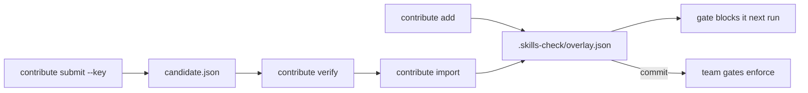

# CLI reference

Complete reference for `skills-check`, the SecureVibe command-line tool — scanners, the CI gate, IDE config generation, the contribution loop, freshness checks, compliance evidence, and library maintenance.

!!! note "Source of truth"
    This page is generated by hand from the Cobra command tree. The authoritative help for any command is always `skills-check <command> --help`. Flags documented here are verified against the source; if a flag is not listed, run `--help` to confirm it before relying on it.

`skills-check` is fully offline — no telemetry, no API key, no cloud dependency. Every command runs against a local skills-library checkout (the data tree the scanners read their rules from).

## Conventions

Several scanner and data commands share a `--path` flag that points at the skills-library checkout. Its resolution order is:

1. an explicit `--path` (anything other than the default `.`);
2. the `$SKILLS_LIBRARY_PATH` environment variable, so the CLI can run inside an arbitrary project (CI, a pre-commit hook) while pointed at a bundled data tree;
3. the current working directory.

The file scanners and `gate` accept a common `--format` flag:

| Value | Meaning |
|-------|---------|
| `text` | Human-readable (default). |
| `json` | Machine-readable; identical schema to the MCP server's response. |
| `sarif` | SARIF document for CI ingestion (GitHub Code Scanning). Only on commands that ship a SARIF transformer: `scan-secrets`, `scan-dependencies`, `scan-dockerfile`, `scan-github-actions`, `gate`, `check-dependency`. |

---

## Scan & gate

The deterministic scanners and the CI gate. Detection is **narrow by design** — four scanners (secrets, dependencies, Dockerfile, GitHub Actions), not a general SAST. They catch known patterns and known-bad packages with high precision; they do not claim to find every vulnerability.

### `scan-secrets`

DLP-style scan of a file — or, recursively, a directory of text files — for credentials, API keys, tokens, and PEM material.

```text
skills-check scan-secrets <file-or-dir> [flags]
```

| Flag | Description |
|------|-------------|
| `--path` | skills-library checkout for rule data (default: `$SKILLS_LIBRARY_PATH`, else cwd). |
| `--format` | `text` \| `json` \| `sarif`. |
| `--report-dir` | Write a self-contained HTML report **and** a matching PDF into this directory instead of printing. |

```bash
skills-check scan-secrets ./src
skills-check scan-secrets config.env --format sarif > secrets.sarif
```

### `scan-dependencies`

Parse a lockfile (or auto-discover lockfiles under a directory) and check every resolved `(name, version)` against the malicious / typosquat / CVE / OSV databases. Supported lockfiles include `package-lock.json`, `yarn.lock`, `pnpm-lock.yaml`, `requirements*.txt`, `poetry.lock`, `go.sum`, `Cargo.lock`, `pom.xml`, `*.csproj`, `Gemfile.lock`, `composer.lock`, `Package.resolved`, and `pubspec.lock`.

```text
skills-check scan-dependencies <lockfile-or-dir> [flags]
```

| Flag | Description |
|------|-------------|
| `--path` | skills-library checkout (default: `$SKILLS_LIBRARY_PATH`, else cwd). |
| `--format` | `text` \| `json` \| `sarif`. |
| `--vuln-source` | Where OSV advisory lookups read from: `local` (no network, default), `external` (api.osv.dev), or `hybrid` (external first, fall back to local). |
| `--report-dir` | Write HTML + PDF reports into this directory. |

```bash
skills-check scan-dependencies package-lock.json
skills-check scan-dependencies . --vuln-source hybrid --format json
```

### `scan-dockerfile`

Hardening pass over a Dockerfile (`USER root`, unpinned base, `ADD` remote, `curl | sh`, secrets in env, and similar).

```text
skills-check scan-dockerfile <Dockerfile> [flags]
```

| Flag | Description |
|------|-------------|
| `--path` | skills-library checkout. |
| `--format` | `text` \| `json` \| `sarif`. |
| `--report-dir` | Write HTML + PDF reports into this directory. |

```bash
skills-check scan-dockerfile Dockerfile --format sarif > docker.sarif
```

### `scan-github-actions`

Lint a GitHub Actions workflow for pwn-request, script-injection, unpinned actions, missing `permissions`, and credential exposure.

```text
skills-check scan-github-actions <workflow.yml> [flags]
```

| Flag | Description |
|------|-------------|
| `--path` | skills-library checkout. |
| `--format` | `text` \| `json` \| `sarif`. |
| `--report-dir` | Write HTML + PDF reports into this directory. |

```bash
skills-check scan-github-actions .github/workflows/ci.yml
```

### `gate`

The canonical "fail the build" entry point. Takes one or more files or directories, auto-selects the right scanner per file (`scan-dependencies` / `scan-dockerfile` / `scan-github-actions`, falling back to `scan-secrets`), and **exits non-zero** when any finding meets the severity floor. Directories are walked, skipping `.git`, `node_modules`, `vendor`, and build output.

```text
skills-check gate <file-or-dir>... [flags]
```

!!! note "Alias"
    `gate` was formerly named `policy-check`; that name still works as an alias.

| Flag | Description |
|------|-------------|
| `--severity-floor` | Lowest severity that causes a non-zero exit: `critical` \| `high` \| `medium` \| `low`. Default `high`. |
| `--sarif-base` | Directory SARIF artifact URIs are made relative to (default `.`); only used with `--format sarif`. |
| `--path` | skills-library checkout. |
| `--format` | `text` \| `json` \| `sarif`. |
| `--report-dir` | Write HTML + PDF reports into this directory (a failing gate still produces its report). |

```bash
# Pre-commit / CI: fail on any high+ finding, emit SARIF for Code Scanning.
skills-check gate . --severity-floor high --format sarif > results.sarif
```

### `check-dependency`

Check a single `package@version` against malicious entries, typosquats, CVE patterns, and OSV advisories. Always exits 0 (use `gate` for a CI-failing scan).

```text
skills-check check-dependency -p <package> -e <ecosystem> [flags]
```

| Flag | Description |
|------|-------------|
| `-p`, `--package` | Package name (required). |
| `-e`, `--ecosystem` | Ecosystem: `npm`, `pypi`, `crates`, `go`, `rubygems`, `maven`, `nuget`, `composer`, `pub`, `swift`, `github-actions`, `docker` (required). |
| `-v`, `--version` | Package version (optional; constrains OSV matching). |
| `--format` | `text` \| `json` \| `sarif`. |
| `--vuln-source` | `local` \| `external` \| `hybrid`. |
| `--path` | skills-library checkout. |

```bash
skills-check check-dependency -p left-pad -e npm -v 1.3.0
```

### `check-typosquat`

Flag candidate typosquats against the curated DB plus a Levenshtein-2 sweep over popular packages.

```text
skills-check check-typosquat -p <package> [flags]
```

| Flag | Description |
|------|-------------|
| `-p`, `--package` | Package name to check (required). |
| `-e`, `--ecosystem` | Ecosystem (optional; empty searches all). |
| `--format` | `text` \| `json`. |
| `--path` | skills-library checkout. |

```bash
skills-check check-typosquat -p reqeusts -e pypi
```

### `lookup-vulnerability`

Search the supply-chain malicious-packages corpus plus OSV advisories for a package.

```text
skills-check lookup-vulnerability -p <package> [flags]
```

| Flag | Description |
|------|-------------|
| `-p`, `--package` | Package name (required). |
| `-e`, `--ecosystem` | Ecosystem (optional; empty searches all). |
| `-v`, `--version` | Version (optional). |
| `--format` | `text` \| `json`. |
| `--vuln-source` | `local` \| `external` \| `hybrid`. |
| `--path` | skills-library checkout. |

```bash
skills-check lookup-vulnerability -p event-stream -e npm --vuln-source hybrid
```

---

## IDE integration

Generate the per-assistant configuration that feeds security skills into your coding agent at generation time.

### `init`

Write an IDE-specific config file into the current project (e.g. `CLAUDE.md`, `.cursorrules`, `.github/copilot-instructions.md`, `AGENTS.md`, `.windsurfrules`, `.clinerules`, `devin.md`, or the universal `SECURITY-SKILLS.md`).

```text
skills-check init --tool <tool> [flags]
```

| Flag | Description |
|------|-------------|
| `--tool` | Target tool (required): `claude`, `cursor`, `copilot`, `codex`, `agents`, `windsurf`, `devin`, `cline`, `universal`. |
| `--library` | Path to the skills-library checkout (default `.`). |
| `--skills` | Comma-separated skill IDs to include (narrows a `--profile` selection when combined). |
| `--budget` | Tier override: `minimal` \| `compact` \| `full`. |
| `--out` | Output directory (default: cwd). |
| `--profile` | Enterprise profile, e.g. `financial-services`, `healthcare`, `government` — restricts the skill set. |
| `--no-prompt` | Skip the interactive prompt to set up scheduled updates. |
| `--full-inline` | Render the legacy monolithic per-tool output that inlines every skill body (default is the minimal pointer file). |
| `--legacy` | Alias for `--full-inline`. |

```bash
skills-check init --tool claude
skills-check init --tool cursor --profile financial-services
```

---

## Contribute / LEARN loop

Record a locally-discovered bad package so the gate blocks it immediately — the rule never leaves your machine unless you choose to share it. Overlay scopes, in increasing blast radius:

- **You** — `.skills-check/overlay.json` is read by every `check` / `scan` / `gate` run.
- **Team** — commit `.skills-check/overlay.json`; git is the fan-out.
- **Org** — point `$SKILLS_CHECK_OVERLAY` at a shared overlay file (OS path-list separated for more than one); every invocation folds it in.



### `contribute add`

Add or update a bad-package rule in the local overlay.

```text
skills-check contribute add -p <package> -e <ecosystem> [flags]
```

| Flag | Description |
|------|-------------|
| `-p`, `--package` | Package name (required). |
| `-e`, `--ecosystem` | Ecosystem: `npm`, `pypi`, `crates`, `go`, `rubygems`, `maven`, `nuget`, `composer` (required). |
| `--versions` | Affected versions/ranges (comma-separated; default: all versions). |
| `--severity` | `critical` \| `high` \| `medium` \| `low` (default `high` so the gate blocks). |
| `--type` | Finding type label. |
| `--reason` | Why this package is flagged (shown in the finding). |
| `--references` | Evidence URLs (comma-separated). |
| `--by` | Contributor identifier (default: `$USER`). |
| `--key` | Ed25519 private key (PEM) to sign the entry for provenance. |
| `--dir` | Project directory holding `.skills-check/overlay.json` (default: cwd). |

```bash
skills-check contribute add -p evil-pkg -e npm --reason "exfiltrates AWS creds in postinstall"
skills-check contribute add -p left-pad -e npm --versions 1.0.0,1.1.0 --key ~/key.pem
```

### `contribute list`

List the rules in the local overlay.

| Flag | Description |
|------|-------------|
| `--dir` | Project directory (default: cwd). |
| `--json` | Emit the raw overlay JSON. |

### `contribute remove`

Remove a rule from the local overlay.

```text
skills-check contribute remove -p <package> -e <ecosystem> [flags]
```

| Flag | Description |
|------|-------------|
| `-p`, `--package` | Package name (required). |
| `-e`, `--ecosystem` | Ecosystem (required). |
| `--dir` | Project directory (default: cwd). |

### `contribute keygen`

Generate an Ed25519 keypair for signing contributions.

| Flag | Description |
|------|-------------|
| `--out` | Path to write the Ed25519 private key (PEM, `0600`); the public key is written to `<out>.pub`. Required. |

```bash
skills-check contribute keygen --out ~/securevibe-contrib.pem
```

### `contribute submit`

Export the overlay as a portable, optionally-signed candidate file to share upstream. Nothing is uploaded — this only writes a file.

| Flag | Description |
|------|-------------|
| `--out` | Write the candidate to this file (default: stdout). |
| `--package` | Submit only this package's rule (default: all). |
| `--key` | Ed25519 private key to sign the candidate for provenance. |
| `--dir` | Project directory (default: cwd). |

```bash
skills-check contribute submit --key ~/securevibe-contrib.pem --out candidate.json
```

### `contribute verify`

Verify the signatures on a submitted candidate file. Exits non-zero if any signature is missing or invalid.

```text
skills-check contribute verify <candidate.json>
```

### `contribute import`

Merge a shared candidate file into the local overlay. A signed candidate must verify before any rule is adopted; an unsigned one is refused unless `--allow-unsigned`.

```text
skills-check contribute import <candidate.json> [flags]
```

| Flag | Description |
|------|-------------|
| `--allow-unsigned` | Import a candidate that carries no signature/provenance. |
| `--dir` | Project directory (default: cwd). |

---

## Update & freshness

### `status`

Report how fresh the local skills + vulnerability data is, with a freshness verdict.

| Flag | Description |
|------|-------------|
| `--path` | Library root (default: `$SKILLS_LIBRARY_PATH`, else cwd). |
| `--json` | Emit the report as JSON. |
| `--fail-if-stale` | Exit non-zero when the vulnerability data is older than 30 days (CI gate). |
| `--max-age-days` | Exit non-zero when the data is older than this many days (overrides `--fail-if-stale`). |

```bash
skills-check status
skills-check status --fail-if-stale
```

### `update`

Pull the latest signed skills and vulnerability data from a release channel. Verifies the signed manifest, downloads only files whose SHA-256 differs, and atomically writes them in.

| Flag | Description |
|------|-------------|
| `--source` | Update source: https URL, `file:///path`, local directory, or `.tar.gz` tarball. |
| `--path` | Library root to apply the update into. |
| `--check-only` | Fetch and verify the manifest, then print available updates without applying. |
| `--regenerate` | Regenerate `dist/` from `skills/` after applying. |
| `--rollback` | Restore the previous applied update from `.skills-check-previous/`. |
| `--public-key` | Ed25519 public key file used to verify the manifest (default: embedded). |
| `--skip-signature` | Skip signature verification (testing / bootstrap only). |
| `--quiet` | Suppress non-essential output. |
| `--full-inline` | With `--regenerate`, keep the legacy inlined output. |
| `--legacy` | Alias for `--full-inline`. |

```bash
skills-check update --check-only
skills-check update --regenerate
```

### `fetch-vulns`

Populate the user-local OSV cache (under `$SKILLS_MCP_CACHE`, falling back to `$XDG_CACHE_HOME/skills-mcp/vulns`, then `~/.cache/skills-mcp/vulns`) from osv.dev or a pre-built release asset.

| Flag | Description |
|------|-------------|
| `--path` | Library root (used to locate `scripts/ingest-osv.py`). |
| `--cache-dir` | Override the cache root. |
| `--per-ecosystem` | Max advisories per ecosystem (`0` = full archive, recommended). |
| `--only` | Limit to the named ecosystem(s); repeat or comma-separate. Known: `composer`, `crates`, `go`, `maven`, `npm`, `nuget`, `pub`, `pypi`, `rubygems`, `swift`. |
| `--ordering` | Ordering passed to the ingest script: `stride` \| `latest-first`. |
| `--check` | Verify the cache is present and fresh; do not download. |
| `--max-age-days` | Cache is stale when older than this many days (default 7). |
| `--verbose` | Pass `--verbose` through to the ingest script. |
| `--from-release` | Download the pre-built `osv-cache.tar.gz` from a GitHub release instead of hitting osv.dev. |
| `--release-tag` | Release tag to pull from with `--from-release` (default `latest`). |
| `--release-url` | Explicit URL of the `osv-cache.tar.gz` asset; overrides `--release-tag`. |

```bash
skills-check fetch-vulns --from-release
skills-check fetch-vulns --only npm,pypi --check
```

### `self-update`

Download the latest `skills-check` binary matching the running GOOS/GOARCH from GitHub Releases, verify its SHA-256 against the published checksum file, verify that file's Ed25519 signature against the embedded release key, and atomically replace the running binary.

| Flag | Description |
|------|-------------|
| `--base-url` | Override the base URL the binary and checksum file are fetched from. |
| `--dry-run` | Verify the download without replacing the on-disk binary. |
| `--require-signature` | Fail unless the checksum file carries a valid Ed25519 signature (strict mode). |

```bash
skills-check self-update --dry-run
skills-check self-update --require-signature
```

### `scheduler`

Install or remove a background scheduled update (launchd / systemd / Task Scheduler depending on OS).

| Subcommand | Description |
|------------|-------------|
| `scheduler install` | Install a recurring update task. Flags: `--interval` (default `6h`), `--binary` (default: current binary), `--quiet` (default true). |
| `scheduler remove` | Remove the scheduled update from this host. |
| `scheduler status` | Show whether a scheduled update is installed. |
| `scheduler preview` | Print the launchd/systemd/Task Scheduler artifact that would be written. Flags: `--interval`, `--binary`, `--target` (`darwin` \| `linux` \| `windows`). |

```bash
skills-check scheduler install --interval 12h
skills-check scheduler preview --target linux
```

---

## Compliance

### `evidence`

Emit a compliance coverage report mapping installed skills onto the controls of a framework. It is a developer-facing coverage map, not a full audit artifact.

| Flag | Description |
|------|-------------|
| `--framework` | Compliance framework: `SOC2` \| `HIPAA` \| `PCI-DSS` (required). |
| `--format` | `json` (default) \| `markdown`. |
| `--out` | Write report to this file; `-` or empty for stdout. |
| `--library` | Path to the skills library root (default `.`). |

```bash
skills-check evidence --framework SOC2 --format markdown --out soc2-coverage.md
```

### `configure`

Write or update `.skills-check.yaml` for private-repo / org deployments (update source, signing key, default profile, bearer-token env).

| Flag | Description |
|------|-------------|
| `--dir` | Directory containing `.skills-check.yaml` (default `.`). |
| `--source` | Custom update source URL (e.g. `https://skills.internal/`). |
| `--bearer-token-env` | Env var holding a bearer token (e.g. `SKILLS_LIBRARY_TOKEN`). |
| `--trusted-key` | Additional Ed25519 public key file (repeatable). |
| `--profile` | Default enterprise profile name. |
| `--skills` | Comma-separated default skill set. |
| `--clear-trusted-keys` | Remove existing `trusted_key_paths` before adding new ones. |
| `--clear` | Reset the entire config to defaults before applying flags. |
| `--insecure-allow-http-token` | Permit bearer-token auth over plaintext `http://` (internal networks only; OFF by default). |

```bash
skills-check configure \
    --source https://skills.internal.example.com \
    --trusted-key /etc/skills/orgkey.pem \
    --bearer-token-env SKILLS_LIBRARY_TOKEN
```

---

## Maintenance & build

Commands used when authoring skills or building the library distribution.

### `list`

List skills with category, severity, and per-tier token counts.

| Flag | Description |
|------|-------------|
| `--path` | Library root. |
| `--category` | Filter by category. |

### `coverage`

Show, per skill, which `<!-- pattern: ... -->` markers the gate enforces deterministically vs. which it leaves to the agent.

```text
skills-check coverage [skill-id] [flags]
```

| Flag | Description |
|------|-------------|
| `--path` | Library root (default: `$SKILLS_LIBRARY_PATH`, else cwd). |

### `validate`

Validate `SKILL.md` frontmatter, rule files, and token budgets. Exits non-zero on any problem.

| Flag | Description |
|------|-------------|
| `--path` | Library root. |

### `test`

Run a skill's bundled test corpus (`skills/<id>/tests/corpus.json`) and report pass/fail. Exits non-zero on any failure.

```text
skills-check test <skill-id> [flags]
```

| Flag | Description |
|------|-------------|
| `--library` | Path to the skills library root (default `.`). |
| `--verbose` | Print one line per fixture. |

```bash
skills-check test secret-detection --verbose
```

### `new`

Scaffold a new skill directory under `skills/<id>/` with template frontmatter, section stubs, a starter rule file, and a test corpus.

```text
skills-check new <skill-id> [flags]
```

| Flag | Description |
|------|-------------|
| `--library` | Path to the skills library root. |
| `--title` | Human-readable title (defaults to a humanized id). |
| `--description` | One-line description. |
| `--category` | `prevention` \| `detection` \| `compliance` \| `supply-chain` \| `hardening` (default `prevention`). |
| `--severity` | `low` \| `medium` \| `high` \| `critical` (default `high`). |
| `--languages` | Comma-separated language list, or `*` for any. |
| `--rules-kind` | Scaffold a `rules/` or `checklists/` directory (default `rules`). |
| `--force` | Overwrite `skills/<id>/` if it already exists. |

```bash
skills-check new my-skill --title "My Skill" --category prevention --severity high
```

### `regenerate`

Rebuild the `dist/` files from the current `skills/`.

| Flag | Description |
|------|-------------|
| `--path` | Library root. |
| `--tool` | Single tool to regenerate (default all). |
| `--budget` | Override tier: `minimal` \| `compact` \| `full`. |
| `--profile` | Enterprise profile (e.g. `financial-services`). |
| `--full-inline` | Render the legacy monolithic per-tool output. |
| `--legacy` | Alias for `--full-inline`. |
| `--skip-native` | Skip emitting the native skill bundles. |

### `generate-native`

Generate the native skill bundles (`dist/agent-skills`, `dist/copilot-skills`, `dist/claude-skills`) without regenerating the per-tool files.

| Flag | Description |
|------|-------------|
| `--path` | Library root. |

### `derive-checklists`

Derive `checklists/*.yaml` from a skill's `SKILL.md` HTML-comment pattern markers (`<!-- pattern: { id, severity, cwe } -->`). Existing manual rows are preserved (merge semantics).

```text
skills-check derive-checklists <skill-id> [flags]
```

| Flag | Description |
|------|-------------|
| `--path` | Path to the skills-library checkout (default cwd). |
| `--framework` | Target checklist framework when the skill has more than one (must match the YAML basename). |
| `--check` | Dry-run; exit 1 if any target YAML differs from the derived form (CI drift gate). |

### `manifest`

Inspect, recompute, sign, and verify the root `manifest.json` (the per-file SHA-256 + Ed25519 signature that anchors `update` and `self-update` trust).

| Subcommand | Description |
|------------|-------------|
| `manifest compute` | Walk distributable roots and update checksums. Flags: `--path`, `--write`, `--prune`. |
| `manifest verify` | Verify the manifest signature and per-file checksums. Flags: `--path`, `--public-key`, `--checksums-only`. |
| `manifest sign` | Sign `manifest.json` with an Ed25519 private key. Flags: `--path`, `--key` (required). |
| `manifest sign-file` | Write a detached `<file>.sig` signature for a release artifact. Flags: `--key` (required), `--out`. |
| `manifest verify-file` | Verify a detached signature for a release artifact. Flags: `--public-key`, `--sig`. |
| `manifest delta` | Compute a delta patch between two manifest files. Flags: `--from` (required), `--to` (required), `--out`. |

```bash
skills-check manifest compute --path . --write
skills-check manifest verify --checksums-only
```

### `version`

Print the CLI version, library version, embedded signing-key id, and Go version.

| Flag | Description |
|------|-------------|
| `--path` | Library root containing `manifest.json`. |

---

## See also

- [Quick start](../quickstart.md)
- [Developer guide](../guides/developer.md)
- [Contribute](../contribute.md)
